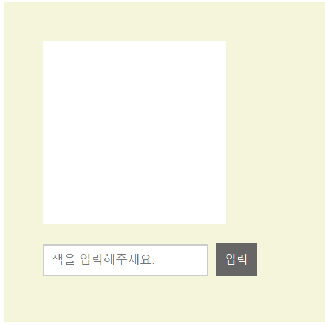
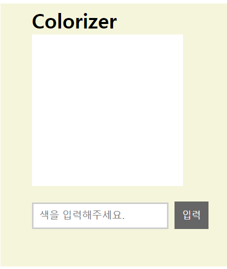
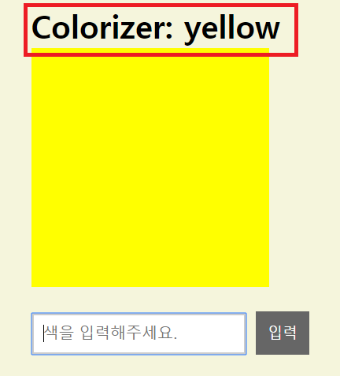

# ☄ Access DOM Element

> 자바스크립트의 DOM API를 통해 직접 HTML element를 다루는 일이 'react 방식'보다 쉬운 경우가 많다.

## Example
> 파일위치 : html/12/domAPI.html

### Colorizer



- colorizer는 흰색의 정사각형을 원하는 color로 바꿔주는 예제이다.
- 전형적인 react 기법과 JSX를 사용해서 구현하려면 매우 번거롭다.
- 위의 예제는 JSX 방식으로 구현해본 예제이다.

### ref와 첫 만남
- 대부분의 경우 render 메소드 안에서 HTML을 닮은 JSX 코드를 작성했다.
- 하지만 HTML과 닮았을뿐 실제 HTML을 대변하지 않는다.
- 이를 보안하기 위해 React는 DOM안에서 최종 HTML element와 JSX 사이를 연결해주는, `ref`라는 기능을 제공한다.

> 파일위치 : html/12/ref.html

```js
<input onChange={this.colorValue}
     ref = {
        function(el){
            self._input = el;
            }
        }
    placeholder = "색을 입력해주세요.">
</input>
```
- 우리의 관심 대상은 input element이므로, ref속성을 추가했다.
- 현재 component가 mount 되면 자동으로 호출될 자바스크립트 콜백 함수를 ref 속성 값으로 설정한다.
- component가 mount되면 component 안의 어디서든 self._input을 사용해 input element를 나타내는 HTML에 접근할 수 있다.

```JS
var self = this;

function(el){
    self._input = el;
    }
}
```
- 이 익명 함수는 component가 mount되면 호출되며, 최종 HTML DOM element에 대한 참조를 인자로 받는다.
- 이 함수는 단순히 _input이라는 커스텀 속성에 DOM element의 값을 지정하는 일을 한다.
- component에 _input 속성을 만들기 위해 self 변수를 사용해 clousuer를 만들었다. ( 여기서 this는 콜백 함수가 아닌 component 참조)

```js
this._input.focus();
this._input.value = "";   
```

- `this._input.value = "";`을 호출함으로써 input element에 입력됐던 내용은 삭제될것이다.
- `this._input.focus();`를 호출해 input element로 focus가 가게 했다.


## 포털 사용하기
- 지금까지는 단일 컴포넌트든 복수 컴포넌트의 조합이든 오직 JSX가 만드는 결과로써 HTML을 다뤘다.
- 이는 부모 컴포넌트가 강제하는 DOM 계층 구조로 제한된다는 의미이다.
- 사실은 JSX를 부모 component에게만 보내게 제한돼 있지 않으며, JSX를 페이지의 어느 곳이든 DOM element로 렌더링 시킬 수 있다.

> 파일 위치 : html/12/portal.html



- 여기서 현재 보여주고 있는 color의 이름으로 h1 element의 값이 바뀌게 해보자.
- 핵심은 container div와 h1이 형제 element라는 점이다.

- `<ColorLabel color = {this.state.bgColor} />` : ColorLabel이라는 component를 인스터스화 했으며, state.bgColor 속성을 color 속성 값으로 설정했다.

```js
var heading  = document.querySelector("#colorHeading");

class ColorLabel extends React.Component{
        render(){
            return ReactDOM.createPortal(
                ": " + this.props.color,
                heading
            );
        }
    }
```
- h1의 element를 참조하기 위해 heading 이라는 벼수를 만들었다.
- 여기서 주의 깊게 봐야할 구문은 `ReactDOM.createPortal()`이다.

- ReactDOM.createPortal()은 2개의 인자를 받는다. 
    1. 출력될 내용의 JSX
    2. 그 JSX를 출력 시킬 대상 DOM element



**포털을 사용함으로써 부모와 자식으로 이뤄진 기존 계층 구조에 갇히지 않고 페이지의 어느 element든 직접 접근이 가능하게 된다.**

> ref를 사용하면 JSX 뒤에 가려 있는 HTML에 접근 할 수 있다. portal을 사용하면 접근하고자 하는 DOM의 어느 element에도 contents를 rendering 할 수 있다.