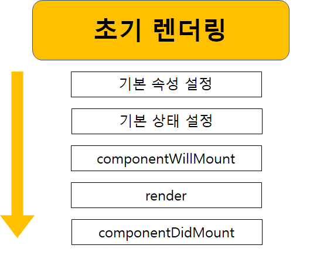
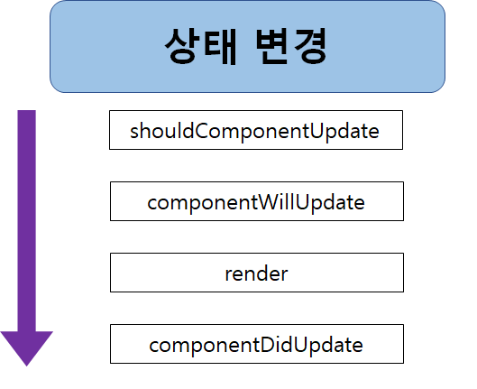
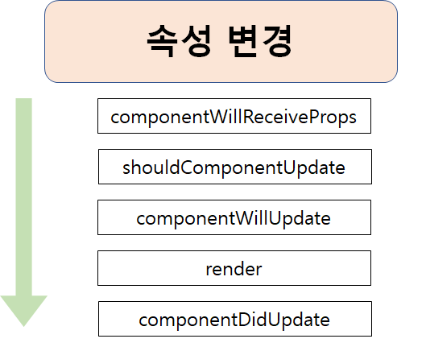
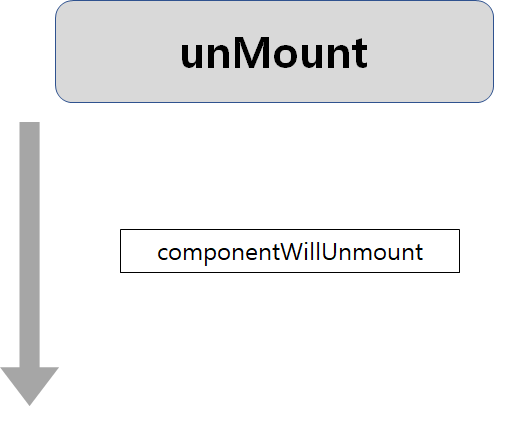

# 🚲 Component Life Cycle

> Component는 속성, 상태, 이벤트를 다룰 때 도움을 주며, 종종 다른 Component의 상태에 대해서도 책임을 진다. 따라서 Component가 하는 모든일을 추적하는 작업은 쉽지 않다.

> 이를 위해 리액트는 생명주기 메소드를 제공한다.

## 생명주기 메소드와의 만남
- Component의 일생에서 다양한 시점에 호출되는 이벤트 핸들러라고 생각하면 된다. 
- 생명주기 메소드에는 
`componentWillMount` , `componentDidMount`, `componentWillUnmount`,`componentDidUpdate`, `componentWillReceiveProps`,`shouldComponentUpdate`,`componentDidCatch` 등이 있다.

## First Stage
- 컴포넌트가 삶을 시작하고 DOM으로 가는 길을 걷는 중에는 다음과 같은 생명주기 메소드들이 호출된다.



#### 기본 속성 설정
- Component의 defaultProps 속성은 this.props의 기본값을 지정할 수 있게 해준다.
```js
CounterParent.defaultProps = {
    name : "lee hosu"
};
```
- CounterParent component의 name 속성을 설정하려면 위와 같이 하면 된다.
- 그러면 Component가 생성되기 전이나 부모로부터 속성이 전달될 때 실행된다.

#### 기본 상태 설정
- 이 단계는 컴포넌트의 생성자 안에서 진행된다.
- Component의 생성 과정에서 this.state의 기본 값을 지정한다.

```js
constructor(props){
    super(props);

    this.state = {
        count :0
    };
}
```
- 위의 예제를 보면 state 객체를 정의 했고 count 속성을 0으로 초기화했다. => 기본 상태 설정.

#### componentWillMount
- component가 DOM 안으로 렌더링되기 전에 호출되는 마지막 메소드이다.
- ***이 메소드 안에서는 setState를 호출해도 component가 다시 렌더링 되지 않는다.***

#### render
- 모든 component에 정의되어 있어야 하는 메소드이며, JSX를 return하는 책임을 갖는다.
- rendering이 필요없다면 단순히 null이나 false를 return하면 된다.

#### componentDidMount
- component가 rendering 돼 DOM에 자리 잡은 직후 호출된다.
- 모든 준비를 마친 component에만 의존하는 코드를 지정하면 된다.

**render 메소드를 제외하면 지금까지의 모든 생명주기 메소드들은 한번 만 실행된다.**

## Update Stage
- 일단 component가 DOM 안으로 추가되면, 이후에 속성이나 상태가 변경될 때 update되며 다시 rendering 된다. 
- 이 과정에서 또 다른 생명주기 메소드들이 호출된다.

### Change State Control
- 상태가 변경되면 Component는 render 메소드를 다시 호출한다.
- 그 component의 결과에 의존하는 다른 모든 component 역시 자신들의 render 메소드를 호출한다.



#### shouldComponentUpdate
- 이 메소드는 상태가 변경되었어도 업데이트 여부를 제어할 수 있게 해준다.
- ture를 return하면 update가 실행되고 false를 return하면 update를 건너뛰게 된다.

```js
shouldComponentUpdate(newProps, newState){
    if(newState.count<5){
        console("start Update!");
        return true;
    } else {
        ReactDOM.unmountComponentAtNode(destination);
        console.log("not update!");
        return false;
    }
}
```
- 이 메소드는 newProps와 newState라는 2개의 인자를 받는다.
- 예제에서는 상태 속성인 id의 값이 5보다 작은지 확인하고 그렇다면 true 리던해 component update를 지시한다. 반대로 그렇지 않으면 false를 리던해 component update를 거부한다.

#### componentWillUpdate
- 이 메소드는 component가 update되기 전에 호출된다.
- 이 메소드 안에서는 this.state를 사용해 상태를 변경할 수 없다.

#### render
- shouldComponentUpdate가 false를 return 함으로써 update 작업을 하지 않는 상황만 제외하면, render 메소드가 다시 호출됨으로써 component가 올바르게 update하게끔 보장한다.

#### componentDidUpdate
- 이 메소드는 component가 update되고 render 메소드의 실행이 끝난 후에 호출된다.
- update 후에 수행하고 싶은 코드가 있다면 적합한 위치이다.

### Change Property Control
-  component가 update되는 또 다른 경우는 DOM 안으로 rendering 된 후에 속성 값이 변경될때이다.



#### componentWillReceiveProps
- 이 메소드는 하나의 인자를 받는데, 그 인자에는 새로 할당하고자 하는 속성값이 포함된다.

## unMount Stage
- 마지막으로 살펴볼 단계는 component가 소멸되고 DOM에서 제거되는 unMount 단계이다.



#### conponentWillReceiveUnmount
- 이 메소드에서 이벤트 리스너를 제거하거나 타이머를 중단하는 등의 뒷정리를 수행한다.
- 이 메소드가 수행된 후에는 component에 실제로 DOM으로부터 제거된다.

