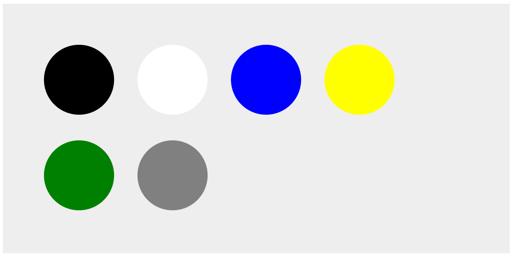
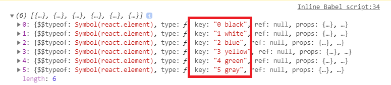

# 🗺  Data To UI

> 개발할때의 대부분의 시간은 데이터를 다루는 일이 차지 할 것이다.
이 장에서는 실전에서 보게 될 일반적인 시나리오를 가지고 튜토리얼을 진행한다.

## Example
> 파일 위치 : html/09/circle.html

#### OverView



#### Circle Component
```JS
class Circle extends React.Component{
        render(){
            var circleStyle = {
                padding :10,
                margin:20,
                display:"inline-block",
                backgroundColor:this.props.bgColor,
                borderRadius:"50%",
                width:100,
                height:100
            };

            return(
                <div style ={circleStyle}>
                </div>
            );
        }
    }
```
- Style 속성을 추가하여 원으로 만드는 Component이다.

#### JSX 응용
- JSX가 render 함수의 외부에 존재하면서 변수나 속성의 값으로 사용되는 경우를 통해 응용해본다.
```js
var theCircle = <Circle bgColor ="#F9C240" />;

ReactDOM.render(
    <div>
         {theCircle}
    </div>,
    destination
);
```

- 함수 외부에 변수 형태로 Component를 정의하면서 응용한다.
- theCircle 변수는 Circle Component를 인스턴스화 하기 위한 JSX가 담긴다.

#### 배열 다루기
```js
 var color = ["black", "white", "blue",
                 "yellow", "green", "gray"];

var renderData = [];

for (var i=0 ; i < color.length ; i++){
    renderData.push(<Circle bgColor ={color[i]} />);
}
```
- 이렇게 배열로 처리 할 수 있지만 이것보다 효과적인 방법이 있다.
- 리액트가 빠르게 UI를 갱신할 수 있는 이유는 DOM에서 일어나는 일을 정확히 파악하고 있기 때문이다.
- 그 중 element에 식별자를 지정하는 방법이다.

#### key 속성 부여
```js
for (var i=0 ; i < colors.length ; i++){
    var color = colors[i];
    renderData.push(<Circle key = {i+color} bgColor ={color} />);
}
```
- 각 Component에 대해 key 속성을 추가하고 color와 index의 조합을 그 값으로 지정한다.
- 이렇게 함으로써 동적으로 Component가 생성될 때, 리액트가 추후 UI 갱신 최적화에 사용한 유일한 식별자도 만들어진다.




