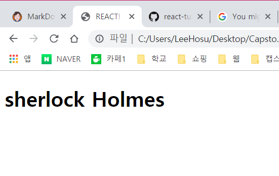
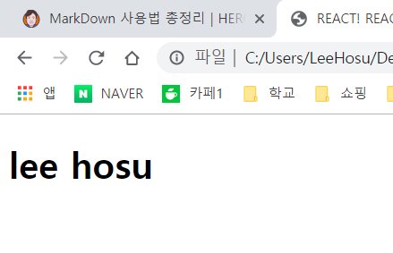
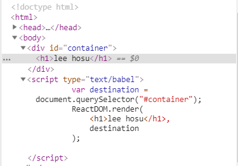

# 👁  First React App

## JSX다루기
- REACT는 우리가 써본 자바스크립트 라이브러리와는 다르다.
- 웹앱의 최종 결과는 반드시 HTML,CSS, JS의 조합으로 만들어야하는데 JSX를 사용하면 쉽게 위의 3가지를 조합 할 수 있다.
- 하지만 문제점이 한가지있다. 바로, 브라우저가 JSX를 인식하지 못한다.

브라우저가 JSX를 인식하게 하는 방법으로는
1. node.js와 그 외의 빌드 툴을 이용해 구축한다.
    - 이경우 빌드때마다 자동적으로 변환되며, 파일이 디스크에 저장된다.
    -> 오늘날 현대적인 웹개발에서 대표적인 방식이다.

2. 런타임 시에 브라우저가 JSX를 자바스크립트로 자동 변환되게 한다.
    - 이 경우 다른 자바스크립트의 경우처럼 JSX를 직접 지정함녀 되고, 나머지는 브라우저가 알아서 처리한다.
    -> 개발 환경에 손을 대는 시간을 절약하고 그 대신 코드 작성에 더 많이 집중할 수 있는 방법이다.

> 파일 위치 : html/ex1.html

```js
ReactDOM.render(
    <h1>sherlock Holmes</h1>,
    document.body
);
```
render 메소드는 2개의 인자를 받는다.
1. 화면에 출력하고 싶은 HTML (즉, JSX)
2. 그 JSX를 렌더링해 보여줄 DOM안의 위치

- 단순히 JSX로부터 변환된 마크업을 DOM안에 어디에 위치할 것인지 기정만 한다.



## 익숙한 기술 JSX
JSX덕분에 JS가 새롭고 빛나 보이지만, 결국 브라우저가 인식하는 최종결과는 깔끔한 HTML, CSS, JS뿐이다.

#### 출력 위치 변경
처음 할 일은 JSX가 출력될 위치를 변경하는 것인데, 자바스크립트를 이용해 body 엘리먼트안에 바로 집어 넣는 방법은 결코 좋은 생각이 아니다.
따라서, 별도의 새로운 element를 하나 만들어, 이를 새로운 루트 엘리먼트로 사용하는 방법을 권장한다.
- render 메소드가 사용할 목적지 역할을 한다.

```js
<div id = "container"></div>
<script type="text/babel">
    var destination = document.querySelector("#container");
    ReactDOM.render(
        <h1>lee hosu</h1>,
      destination
    );
</script>
```
- render 메소드의 외부에서 목적지를 정의하는 방법을 이용해 컨테이너 DOM element의 참조를 지정한다.




- container 안에 ```<h1> lee hosu </h1>```이 씌여진걸 확인할 수 있다.


## 정리
> 리액트가 JSX라는 새로운 언어를 사용해 비주얼을 정의한다는 점에서 다른 라이브러리와 차별된다.
