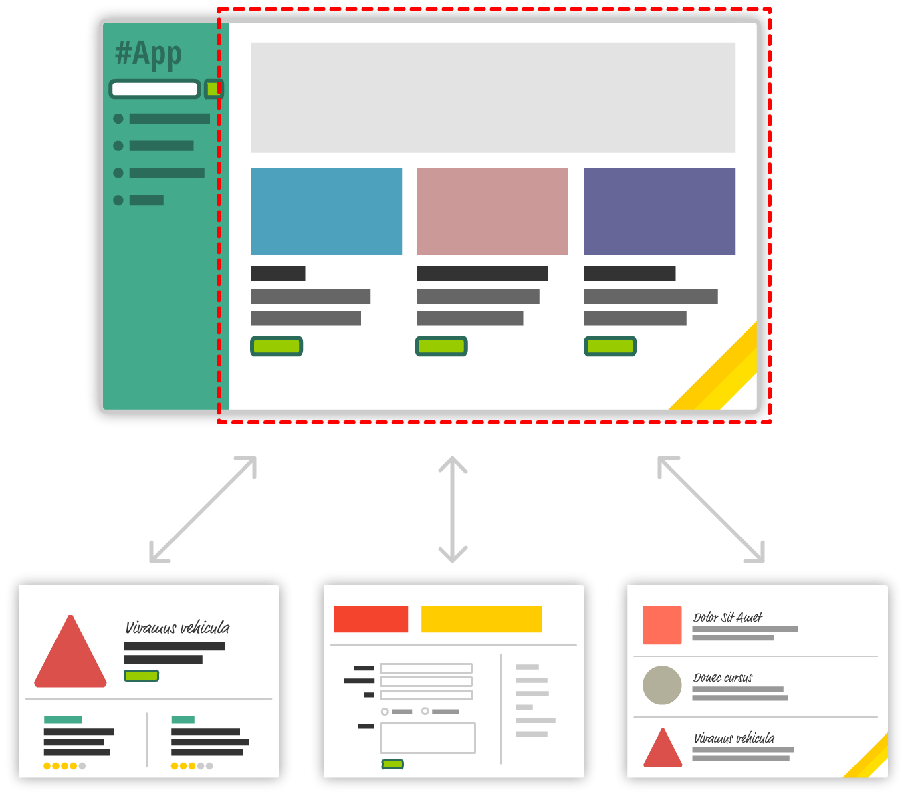

# 🖼 Introduce about REACT
- 현대의 앱은 이른바 싱글 페이지 앱 (Single Page-App|SPA)모델을 고수한다.
- 앱의 서로 다른 view가 동일한 페이지에서 로딩되거나 언로딩된다.


- 사용자가 앱을 사용함에 따라 빨간 점선의 영역의 콘텐츠는 사용자가 원하는 데이터와 HTML로 대체된다.

## SPA 문제점 3가지
1) 싱글 페이지 앱에서는 데이터와 UI의 동기화에 많은 시간을 쏟게 된다.
2) DOM 관련 작업들은 브라우저에서 일어나는 가장 느린 작업임에도 싱글 페이지 앱에서는 아주 많이 필요하다.
3) HTML 템플릿을 다뤄야한다.

=> 이를 효과적으로 다루기 위해 REACT가 존재한다.

## What is REACT ?
#### UI 상태의 자동관리
싱글 페이지 앱에서 UI의 추적과 상태 관리는 힘들고 시간이 많이든다.
하지만 REACT를 사용하면 오찍 하나만 신경쓰면 된다.
바로 ***UI의 마지막 상태*** 이다.
나머지는 리액트가 알아서 모두 관리한다.
리액트는 UI가 제대로 표현되는 것을 보장하기 위해 필요한 사항을 알아서 생성하고 만드므로, 개발자는 상태 관리와 관련된 모든 사항을 더이상 신경쓰지 않아도 된다.

#### 빠른 DOM 조작
- DOM은 정말 느리기 때문에 리액트를 사용할때 직접 DOM을 조작하지 않는다.
-> 그 대신 REACT는 memory상에 가상 DOM을 만들어 조작한다.
- 가상 DOM 조작은 매우 빠르며, 리액트는 필요한 시점에만 DOM을 refresh한다. 
- 리액트는 가장 DOM과 실제 DOM을 비교해 변경돼야하는 부분을 파악한 다음, 모든 사항을 최신으로 유지하는데 필요한 최소한의 DOM 변경을 수행한다.
- 이 과정은 **재조정(reconciliation)** 이라고 합니다.

#### 조립하기 쉬운 UI를 지원하는 API
REACT는 가급적 작은 여러 컴포넌트로 작게 분해해 다루기를 권장한다.
즉, 대상을 작고 독립적인 모듈로 만드는 것이 REACT의 핵심 API이다.

#### 자바스크립트만으로 정의하는 비주얼
자바스크립트만으로 UI를 정의하면 템플릿 안에서 모든 종류의 작업을 자바스트립트가 제공하는 기능을 사용할 수 있다.

자바 스크립트만으로 비주얼을 정의한다고 생각한다면 아마 엄청나게 많은 따옴표, 확장문자, createElement 호출등으로 복잡하고 난해한 코드를 생각하겠지만 REACT는 자바 스크립트와 호환되면서 HTML과 닮은 JSX이라고 하는 문법을 사용해 제공한다.

```JSX
ReactDom.render(
    <div>
        <h1> Super man</h1>
        <h1> Iron man</h1>
        <h1> Bat man</h1>
        <h1> Mega man</h1>
    </div>
);
```
- 동일한 코드를 JavaScript로 작성한다면,
```js
ReactDOM.render(React.createElement(
    "div",
    null,
    React.createElement(
        "hi",
        null,
        "Super man"
    ),
    React.createElement(
        "hi",
        null,
        "Iron man"
    ),
    ...
),destination);
```
- REACT에서는 비주얼 코드와 자바스크립트가 같은 장소에 존재한다.
즉, **하나의 비주얼 컴포넌트의 모양과 동작을 정의하기 위해 더 이상 여러 파일 사이를 뛰어다닐 필요가 없다.**
-> 이것이 올바른 템플릿 작업이다.

#### MVC 아키텍처에서의 "V"
REACT는 앱 개발의 모든 사항을 챙미지는, 완전히 갖춘 프레임워크가 아니다.
그 대신 비주얼 적인 요소와 그 상태를 최신으로 유지하는데 중점을 둔 view 레이어에서 작동한다.
- 이는 mvc 패턴에서 M과 C에 해당하는 부분은 무엇이든 원하는 대로 자유롭게 사용할 수 있다는 의미이다.
