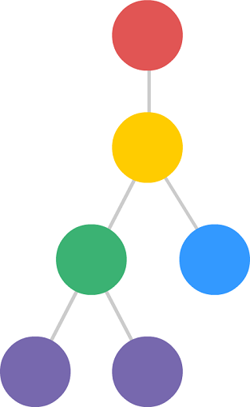
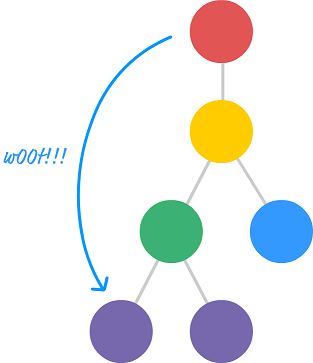
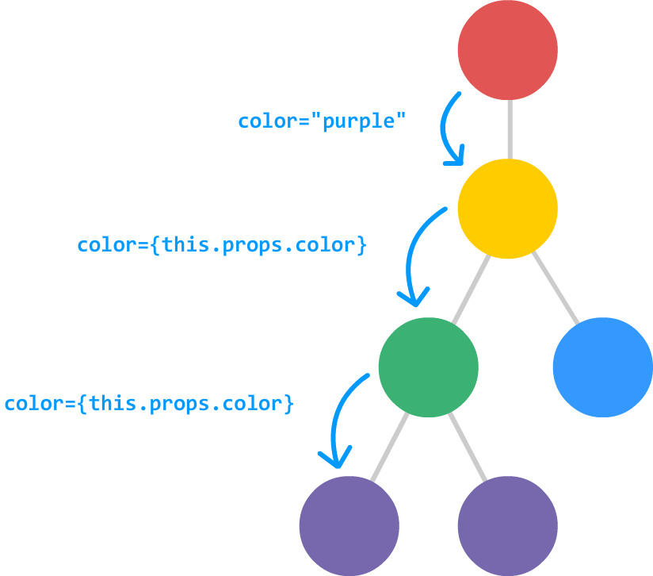
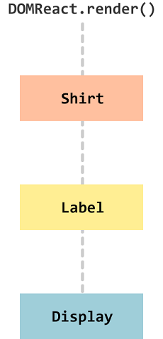

# 🧤 Pass On Property

> 여러 계층에 걸쳐 컴포넌트 사이에 속성을 전달해야 하는 상황이라면 일이 복잡해진다. 그 해결법을 이번 장에서 공부한다.

#### OverView
- 겹겹이 연결된 컴포넌트 들이 있고 그 계층 구조가 아래와 같다고 하자.



- 빨간색 원에서 자주색 원으로 속성을 전달하려고 한다. 하지만 아래와 같이 속성을 전달할 수 는 없다.



*리액트는 반드시 부모 컴포넌트에서 직계 자식 컴포넌트로만 속성이 내려가게 하는 연쇄적인 명령 실행만 가능하다.* 
***중간 계층을 건너 뛸 수 없다는 의미이다.***

- color라는 속성을 빨간색 컴포넌트에서 자주색 컴포넌트로 보내야한다면, 아래와 같은 그림일 것이다.



- 하지만 속성이 하나라면 간단하지만 보내고자하는 속성이 두개라면, 세개가 된다면 복잡해진다.

## Example
#### Display Component
```js
class Display extends React.Component{
        render(){
            return(
                <div>
                    <p>{this.props.color}</p>
                    <p>{this.props.num}</p>
                    <p>{this.props.size}</p>
                </div>
            );
        }
    }
```

#### Label Component
```JS
    class Label extends React.Component{
        render(){
            return(
                <Dispaly color ={this.props.color}
                         num = {this.props.num}
                         size = {this.props.size} />
            );
        }
    }
```

#### Shirt Component
```js
    class Shirt extends React.Component{
        render(){
            return(
                <Label color ={this.props.color}
                        num = {this.props.num}
                        size = {this.props.size} />
            );
        }
    }
```

#### ReactDOM.render
```js
    ReactDOM.render(
        <div>
            <Shirt color = "skyblue" num = "3.14" size = "large" />
        </div>,
        destination
     );
```

- 위의 코드들을 보면 Display Component와 Display Component의 출력 결과에 의존하는 Label Component, Label Component에 의존하는 Shirt Component가 있다.



#### Review
`<Shirt color = "skyblue" num = "3.14" size = "large" />`
- 이 속성 3개가 호출되고 전달되는 주요 값들이다.
- 호출되는 순서는 Shirt Component -> Label Component -> Display Component가 된다.
- 이 값들이 애당초 ReactDOM.render에서 정의 되었다는게 문제이다.
- 이렇게 속성이 Component 간의 이동을 할 때 만약 속성이 하나가 아니라 10개라면? 더 복잡해질 코드를 짤 것인가?

## Spread Operator
- 여러 속성의 전달에 대한 해결책은 최근 자바스크립트 표준에 포함된 스프레드 연산자에 있다.

#### Example
```js

var items = ["1","2","3"];

function printStuff(a,b,c){
    console.log("printing :"+a+b+c);
}
```
위의 예제는 items 배열을 하나씩 출력 시키는 함수이다.
1. spread 연산을 사용하는 방법
` printStuff(...items);`
2. spread 연산 미사용 방법
` printStuff(items[0],items[1],items[2]); `

## Spread 연산자 사용
#### Display Component
```js
class Display extends React.Component{
        render(){
            return(
                <div>
                    <p>{this.props.color}</p>
                    <p>{this.props.num}</p>
                    <p>{this.props.size}</p>
                </div>
            );
        }
    }
```

#### Label Component
```JS
    class Label extends React.Component{
        render(){
            return(
                <Dispaly {...this.props} />
            );
        }
    }
```

#### Shirt Component
```js
    class Shirt extends React.Component{
        render(){
            return(
                <Label {...this.props} />
            );
        }
    }
```

#### ReactDOM.render
```js
    ReactDOM.render(
        <div>
            <Shirt color = "skyblue" num = "3.14" size = "large" />
        </div>,
        destination
     );
```

- 가장 큰 차이는 컴포넌트를 호출 할때 각 속성을 일일이 풀어서 전달할 필요가 없다는 것이다.
- **스프레트 연산자를 사용하면 속성을 추가하거나, 이름을 바꾸거나, 삭제하거나, 그 밖의 속성과 관련된 어떤 장난을 치는 경우라도 수많은 변경 작업을 할 필요가 없다.**
