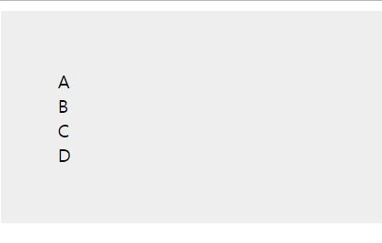
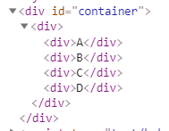
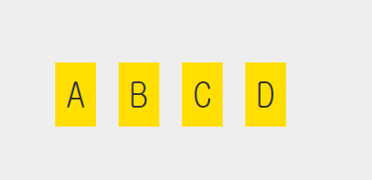
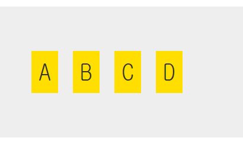
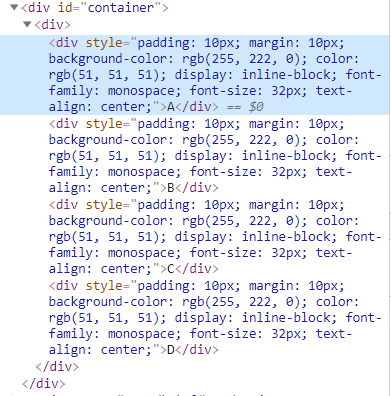
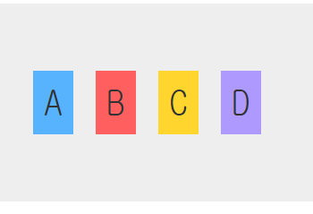

# 👔 React Styling

- 어떤 UI 컴포넌트를 위한 스타일이 다른 어딘가에 있다면, 독립적인 UI 컴포넌트가 될 수 없다.

> 파일 위치 : html/styling.html

```js
 class Letter extends React.Component{
    render(){
        return(
            <div>
                {this.props.children}
            </div>
        );
    }
}

ReactDOM.render(
    <div>
        <Letter>A</Letter>
        <Letter>B</Letter>
        <Letter>C</Letter>
        <Letter>D</Letter>
    </div>,
     destination
);
```
```css
   #container{
        padding: 50px;
        background-color: #EEE;
    }
```
- 이렇게 적용하고 브라우저를 확인해보면 아래 처럼 적용되어있다.


- 여기서 css가 주의할 점은 생성된 HTML을 이해해야한다.
- 코드를 보면 각각의 div태그로 감싸인다. 

- 그렇기 때문에 이 DOM의 구조는 div div div로 감싸여져있다.

#### 가장 간단한 css 
```css
 div div div{
        padding:10px;
        margin:10px;
        background-color: #FFDE00;
        color : #333;
        display: inline-block;
        font-family: monospace;
        font-size:32px;
        text-align: center;
    }
```


- 이렇게 div div div 셀렉터는 스타일링을 할 대상을 정확이 지정한다.
- 하지만 div는 너무 중첩되고 이상하게 보인다.

#### JSX 스러운 css
```JS
  class Letter extends React.Component{
        render(){
            return(
                <div className="letter">
                    {this.props.children}
                </div>
            );
        }
    }
```
- 이렇게 컴포넌트에 letter라는 class 속성을 가지게 하는데 class가 아닌 className을 사용한다.
- 그 후 div element가 지목하는 CSS 셀렉터를 수정한다.
```CSS
.letter {
        padding:10px;
        margin:10px;
        background-color: #FFDE00;
        color : #333;
        display: inline-block;
        font-family: monospace;
        font-size:32px;
        text-align: center;
    }
```


## React 방식의 Styling
- React는 CSS를 사용하지 않는 인라인 방식의 Styling을 선호한다.
-> 비주얼 컴포넌트의 재사용성을 높일 수 있기 때문이다.

1. CSS 속성과 콘텐츠로 갖는 객체를 정의한다.
2. 스타일링 하고 싶은 JSX element에 style 속성을 사용해 그 객체를 할당한다.

> 파일 위치 : html/StylingReact.html

```js
 class Letter extends React.Component{
        render(){
            var letterStyle = {
                padding:10,
                margin:10,
                backgroundColor: "#FFDE00",
                color : "#333",
                display: "inline-block",
                fontFamily: "monospace",
                fontSize:32,
                textAlign: "center"
            };

            return(
                <div style={letterStyle}>
                    {this.props.children}
                </div>
            );
        }
    }f
```
- CSS 속성을 JS 방식으로 변환하는 공식은
    1. 한 단어로 된 CSS 속성(paggin,margin 등)은 그대로 사용한다.
    2. 대시(-)로 연결된 여러 단어로 이루어진 CSS 속성은 카멜 표기법으로 사용한다.
- 그렇게 CSS 속성을 정의한 객체를 콘텐츠에 사용하는 방법은
해당 div에 style 속성을 추가한다. ```  <div style={letterStyle}>```


- 각 스타일이 실제로 inline으로 적용됨을 확인 할 수 있다.

## 배경색 커스터마이징
- 리액트의 스타일 처리 원리를 활용하여 배경색 커스터마이징을 한다.
- JSX안에 스타일을 정의하면 부모를 통해 여러 스타일 값을 쉽게 커스터마이징 할 수 있다.

``` js
 ReactDOM.render(
        <div>
            <Letter bgcolor="#58B3FF">A</Letter>
            <Letter bgcolor="#FF605F">B</Letter>
            <Letter bgcolor="#FFD52E">C</Letter>
            <Letter bgcolor="#AE99FF">D</Letter>
        </div>,
        destination
    );
```
- ReactDOM.render 메소드에서 bgcolor 속성을 추가하고 각각의 색을 지정한다.
그 후 letterStyle 객체의 backgroundColor에 ```this.props.bgcolor```를 설정한다.
```js
 class Letter extends React.Component{
        render(){
            var letterStyle = {
                padding:10,
                margin:10,
                backgroundColor: this.props.bgcolor,
                color : "#333",
                display: "inline-block",
                fontFamily: "monospace",
                fontSize:32,
                textAlign: "center"
            };

            return(
                <div style={letterStyle}>
                    {this.props.children}
                </div>
            );
        }
    }
```
- Letter 선언의 일부인 bgcolor속성을 통해 지정한 값이 backgroundColor에 설정된다.


