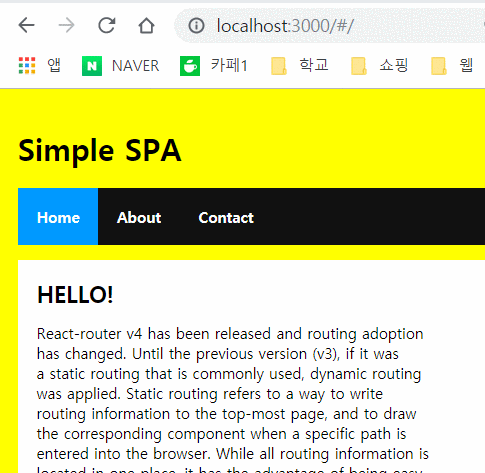
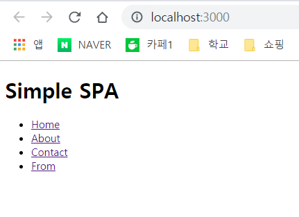

# ⚖ Create a SPA Using React Router

> SPA 제작에서 어려운 점
> 1. 주소 표시줄에 보이는 URL은 항상 지금 보고 있는 화면의 진짜 URL과 같아야한다.
> 2. 브라우저의 이전 버튼과 다음 버튼을 사용할 수 있어야 한다.
> 3. 정확한 URL을 사용해 특정 view를 바로 볼 수 있어야 한다.
>> 이 모든걸 처리하기 위해서는 Routing이라는 기법을 사용해야 한다.


## OverView



## Start
`create-react-app react_spa`
`cd ./react_spa`
`npm i react-router-dom --save`
- 이렇게 하면 적합한 React Router 파일들이 복사되고 package.json에 등록되어 우리 앱에서 사용할 수 있게 된다.

##### public/index.html
```html
<!DOCTYPE html>
<html lang="en">
<head>
    <meta charset="UTF-8">
    <meta name="viewport" content="width=device-width, initial-scale=1.0">
    <meta http-equiv="X-UA-Compatible" content="ie=edge">
    <title>React Router Example</title>
</head>
<body>
    <div id = "root"></div>
</body>
</html>
```

##### src/index.js
```js
import React from "react";
import ReactDOM from "react-dom";


const location = document.querySelector("#root");

ReactDOM.render(
    <Main />,
    location
);
```

## Build a App
- 각각의 "Page"는 main Component에 정보를 반영할 개별 Component로 만든다.

### first frame
- 싱글 페이지 앱에는 항상 정적으로 남아 있는 페이지의 일부가 존재한다.
- 그 정적인 부분을 **앱 프레임**이라고 한다.
- **앱 프레임** 은 모든 Contents를 담는 Container 역할의 HTML element이며 때떄로 헤더, 푸터, 네비게이션등을 포함하기도 한다.

##### src/Main.js
```js
import React, { Component } from "react";


class Main extends Component{
    render() {
        return (
            <div>
                <h1>Simple SPA</h1>
                    <ul className = "header">
                        <li><a href = "/">Home</a></li>
                        <li><a href = "/">About</a></li>
                        <li><a href = "/">Contact</a></li>
                    </ul>    
                <div className = "content"></div>
            </div>
        );
    }
}

export default Main;
```
- 기본 App 구성은 아래와 같이 구현했다.



### Make Contents Page
- 이 앱은 page는 Home, About, Contact로 3개의 Contents page를 갖는다.

##### src/Home.js
```js
import React, { Component } from "react";

class Home extends Component{
    render(){
        return (
            <div>
                <h2> HELLO! </h2>
                <p> React-router v4 has been released and routing adoption 
                    has changed. Until the previous version (v3), if it was
                    a static routing that is commonly used, dynamic routing 
                    was applied. Static routing refers to a way to write 
                    routing information to the top-most page, and to draw 
                    the corresponding component when a specific path is 
                    entered into the browser. While all routing information is 
                    located in one place, it has the advantage of being easy 
                    to manage, but its static nature can reduce scalability 
                    and reusability.</p>
                    
                    
                    <p> Made By Lee Hosu</p>
            </div>
        );
    }
}

export default Home;
```

##### src/About.js
```js
import React, { Component } from "react";

class About extends Component{
    render (){
        return (
            <div>
                <h2> ABOUT </h2>
                <p> lee hosu king wang zzang!</p>
                <ol>
                    <li>Hi</li>
                    <li>My</li>
                    <li>Name</li>
                    <li>is</li>
                    <li>Lee Hosu</li>
                </ol>
            </div>
        );
    }
}

export default About;
```

##### src/Contact.js
```js
import React, { Component } from "react";

class Contact extends Component{
    render (){
        return (
            <div>
                <h2> Contact </h2>
                <p> Contact about me! </p>
                <a href = "https://github.com/leehosu">github</a>
            </div>
        );
    }
}

export default Contact;
```

### Use React Router
- 앱 프레임의 역할은 Main Component가 하며, 각 Contents 페이지는 Home, About, Contact Component로 표현된다.
- 리액트 라우터와 Component를 사용하기 위해 import 추가한다.

##### src/Main.js
```js
import React, { Component } from "react";
import {
    Route,
    NavLink,
    HashRouter
} from "react-router-dom";
import Home from "./Home";
import About from "./About";
import Contact from "./Contact";
.
.
.
```
- 보시다시피 react-router-dom이라는 npm package로부터 Route, NavLink, HashRouter를 import 했다.
- 리액트 라우터는 라우터 영역이라고 부르는 것을 정의함으로써 작동한다. 
    - 네이게이션 링크 
    - 콘텐츠 로딩 컨테이너

##### src/Main.js
```js
.
.
 <HashRouter>     
    <div>
        <h1>Simple SPA</h1>
            <ul className = "header">
                <li><NavLink exact to = "/">Home</NavLink></li>
                <li><NavLink to = "/About">About</NavLink></li>
                <li><NavLink to = "/Contact">Contact</avLink></li>
            </ul>    
            <div className = "content">
                <Route exact path = "/" component = {Home} />
                <Route path = "/About" component = {About} />
                <Route path = "/Contact" component = {Contact}/>
        </div>
    </div>
</HashRouter>

````
- HashRouter Component는 네비게이션과 브라우저의 페이지 이력을 다루기 위한 기반을 제공한다.
- 그 다음엔 네비게이션 링크를 정의한다.
- `to`속성으로 정의된 이들 URL 값은 정확히 해당하는 콘텐츠를 로딩하기 위한 식별자 역할을 수행한다.(`href` 처럼)
- Route Component에는 `path`라는 속성이 있는데, `path`에 지정된 값은 이 라우팅이 활성화되면 component 속성에서 지정한 Component의 렌더링이 시작된다.
- `exact`를 붙여줘야 `"/"`를 따로 인식해서 HOME 콘텐츠를 보여준다.


### Apply The CSS
##### src/index.css
```css
body{
    background-color:yellow;
    padding : 20px;
    margin : 0;
}

h1, h2, p, ul, li{
    font-family: sans-serif;
}

ul.header li {
    display: inline;
    list-style-type : none;
    margin : 0;
}

ul.header {
    background-color: #111;
    padding: 0;
}

ul.header li a{
    color : #FFF;
    font-weight: bold;
    text-decoration: none;
    padding: 20px;
    display: inline-block;
}

.content {
    background-color: #FFF;
    padding: 20px;
}

.content h2 {
    padding: 0;
    margin: 0;
}

.content li {
    margin-bottom: 10px;
}

.active {
    background-color: #0099FF;
}
```
