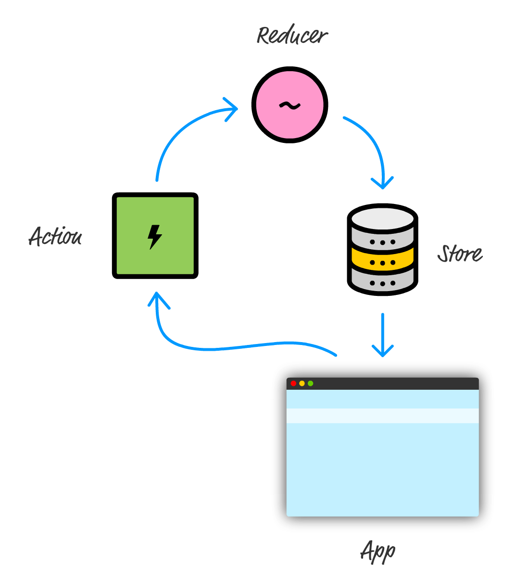

# 🛒 Introduce REDUX

## What is REDUX?
- 애플리케이션의 상태관리 그리고 UI와의 일관성 유지가 중대한 과제이다.
- 이 과제를 해결하는 것이 React와 같은 라이브러리들의 존재 이유 중 하나이다.
- UI 계층 너머까지 바라본다면, 애플리케이션 상태 관리가 대개는 어려운 일이라는 사실을 알게된다.
- ****일반적인 앱은 많은 계층을 가지며, 각 계층은 자신의 기능을 수행하기 위해 저마다 어떤 데이터에 의존한다.****

- Redux는 오직 애플리케이션의 상태를 다루고 저장하는 일을 앱에 부여하는 일만 신경쓴다.
- 즉, Redux 세계에서는 모든 애플리케이션 상태를 `store`라고 하는 단일한 장소에 저장한다.
- `store`로부터 데이터를 읽는 일은 쉬우나, 정보를 스토어에 저장하는 일은 완전히 다른 이야기이다.
- `store`에 새로운 상태 정보를 추가하거나 기존 상태를 변경하는 일은 무엇이 변경됐는지 기술하는 `action`과 그 액션의 결과를 최종 상태를 결정하는 `reducer`의 조합을 사용한다.

> Redux의 3 원칙    
1. 애플리케이션의 모든 상태는 하나의 장소에 저장된다. 즉, 상태의 일부를 갱신하기 위해 다양한 데이터 저장소를 찾아 다니지 않아도 된다. 또한, 단일한 장소에 모든 상태를 저장하게 되면 그 상태 데이터의 정합성에 문제도 걱정할 필요가 없다.
2. 상태는 읽기 전용이며 오직 액션을 통해서만 변경된다. 이전 그림에서 봤듯 Redux 세계에서는 앱의 어떤 일부가 스토어에 직접 접근해 상태를 변경하게 하면 안된다. 스토어 안의 데이터를 변경할 수 있는 유일한 방법은 액션에 의존한다는 것이다.
3. 반드시 마지막 상태가 지정돼야 한다. 쉽게 말하자면, 상태는 결코 수정되거나 변형되지 않는다. 따라서 반드시 리듀서를 사용해 마지막 상태를 지정해야 한다.
