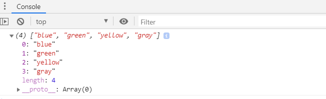

# 🛒 Introduce REDUX

## What is REDUX?
- 애플리케이션의 상태관리 그리고 UI와의 일관성 유지가 중대한 과제이다.
- 이 과제를 해결하는 것이 React와 같은 라이브러리들의 존재 이유 중 하나이다.
- UI 계층 너머까지 바라본다면, 애플리케이션 상태 관리가 대개는 어려운 일이라는 사실을 알게된다.
- ****일반적인 앱은 많은 계층을 가지며, 각 계층은 자신의 기능을 수행하기 위해 저마다 어떤 데이터에 의존한다.****


- Redux는 오직 애플리케이션의 상태를 다루고 저장하는 일을 앱에 부여하는 일만 신경쓴다.
- 즉, Redux 세계에서는 모든 애플리케이션 상태를 `store`라고 하는 단일한 장소에 저장한다.
- `store`로부터 데이터를 읽는 일은 쉬우나, 정보를 스토어에 저장하는 일은 완전히 다른 이야기이다.
- `store`에 새로운 상태 정보를 추가하거나 기존 상태를 변경하는 일은 무엇이 변경됐는지 기술하는 `action`과 그 액션의 결과를 최종 상태를 결정하는 `reducer`의 조합을 사용한다.


> Redux의 3 원칙    
1. 애플리케이션의 모든 상태는 하나의 장소에 저장된다. 즉, 상태의 일부를 갱신하기 위해 다양한 데이터 저장소를 찾아 다니지 않아도 된다. 또한, 단일한 장소에 모든 상태를 저장하게 되면 그 상태 데이터의 정합성에 문제도 걱정할 필요가 없다.
2. 상태는 읽기 전용이며 오직 액션을 통해서만 변경된다. 이전 그림에서 봤듯 Redux 세계에서는 앱의 어떤 일부가 스토어에 직접 접근해 상태를 변경하게 하면 안된다. 스토어 안의 데이터를 변경할 수 있는 유일한 방법은 액션에 의존한다는 것이다.
3. 반드시 마지막 상태가 지정돼야 한다. 쉽게 말하자면, 상태는 결코 수정되거나 변형되지 않는다. 따라서 반드시 리듀서를 사용해 마지막 상태를 지정해야 한다.

### Create Web For Use Redux
- `create-react-app` 을 사용하지 않고 만들어본다.

> 파일위치 : useRedux/favoriteColors.html

```html
<!DOCTYPE html>
<html>
<head>
    <meta charset='utf-8'>
    <title>favorite colors!</title>
    <script src = "https://unpkg.com/redux@latest/dist/redux.js"></script>
</head>
<body>
    <h1> hi </h1>
</body>
</html>

```
- 이 HTML은 아주 기본적인 구조만 정의된 빈 문서이다.
- Redux 라이브러리의 호스팅 버전을 참조하는데, 이는 처음 시작하게 좋다.

#### Action 
- 리덕스 라이브러리를 참조했으니, 이제 `action`을 정의해야한다.
- **오직 `action`만이 스토어와 통신하기 위한 유일한 메커니즘이다.**

```js
function addColor(value){
    return {
        type:"ADD",
        color : value
    };
}    

function removeColor(value){
    return {
         type : "REMOVE",
         color : value
    };
}
```
- addColor와 removeColor라는 두 개의 함수가 있다.
- 각각은 하나의 인자를 받아 그 결과로 `action`을 `return` 한다.
- `action`을 정의하는 방법은 자유로운데, 모든 `action` 객체는 하나의 `type` 속성을 갖는다.
- 여기서는 `store`로부터 color를 추가하거나 제거할 목적이므로 대상 컬러를 지정할 `color` 속성을 `action` 객체에 추가했다.
- 두 함수는 모두 하나의 `action`을 `return`하는 역할을 하는데, redux 세계에서 이런 함수를 `action creator`라고 부른다.

#### Reducer
- `action`이 하고자 하는 일을 정의한다면, `reducer`는 그게 무슨 일인지와 새로운 상태를 정의하는 방법을 다룬다.
- 즉, **`reducer`를 `store`와 바깥 세상의 중개인 정도로 생각하면 된다.**
> reducer의 기능 3가지.
    1. `store`의 원래 상태에 접근할 수 있게 한다.
    2. 현재 발생된 `action`을 조사할 수 있게 한다.
    3. `store`에 새로운 상태를 저장할 수 있게 한다.

``` js
 function favoriteColors(state,action){
    if(state === undefined){
        state = [];
    }

    if(action.type === "ADD"){
        return state.concat(action.color);
    } else if(action.type === "REMOVE"){
        return state.filter(function(item){
            return item !== action.color;
        });
    } else {
        return state;
        }
    }
```

- 만약 상태 객체가 존재하지 않는다면 마치 앱이 처음 구동됐을 때처럼 상태 객체를 빈배열로 초기화한다.
- 이 `reducer`가 `action`객체 자체를 인자로 받는다는 점에 주목해야한다.
- 이는 `action`의 `type` 속성뿐만 아니라 `action`안에 지정된 모든 정보에 접근할 수 있다는 의미이다.
- 즉, type이 ADD라면 액션의 color 속성에 지정된 컬러를 상태에 추가한다. REMOVE라면 제외하고 새로운 배열을 리턴한다.

> reducer 안에서 절대 하지 말아야 할 사항
    1. 받은 인자의 변형
    2. API 호출이나 라우팅 변경 등과 같은 추가 기능 구현
    3. Date.now()나 Math.random()과 같은 비순수 함수의 호출

- **`reducer`는 오직 주어진 인자로 다음 상태를 산출해 `return`해야한다.**

- 지금 예제에서도 위의 사항을 준수했는데, 상태 배열에 새 컬러를 추가하기 위해 기존값에 더해 새값이 포함된 완전히 새로운 배열을 `return`하는 `connat` 메소드를 사용했다.
- 만약 push 메소드를 하용했다면 결과는 동일했겠지만, 기존 상태를 변경했으므로 규칙 위반이 된다. 삭제할때도 마찬가지로 filter 메소드를 사용해 새로운 배열을 리턴한다.

#### Store
- 이제 남은 건 `action`과 `reducer`를 스토어에 엮는 일이다.
- favoriteColor 함수 아래에 다음을 추가한다.
`var store = Redux.createStore(favoriteColors);`

- 이로써 redux로 애플리케이션 상태를 저장하는 과정의 한 바퀴를 돌았다.
-즉, `store`가 있고 `reducer`가 있으며, `reducer`가 해야 할 일을 알려주는 `action`을 갖춘 것이다.
- `action`을 인자로 받는 dispatch 메소드를 store 객체에 사용하면 된다.

``` js
store.dispatch(addColor("blue"));
store.dispatch(addColor("red"));
store.dispatch(addColor("green"));
store.dispatch(addColor("yellow"));
store.dispatch(addColor("gray"));
store.dispatch(removeColor("red"));
```

- 각 dispatch 호출은 `action`을 `reducer`로 전달한다.
- 현재의 `store`상태를 보고싶다면 `console.log(store.getState())`를 추가하면 된다.




> 이 장에서는 Redux를 정신없이 여행하며 주요 기능들을 살펴봤다.
애플리케이션의 상태 관리에서 Redux가 진정으로 유용한 이유에 대한 개념뿐만 아니라, 그 모든 걸 실현하는 코드도 살펴봤다.
다음 장에서는 React와 Redux를 함께 사용해본다.
