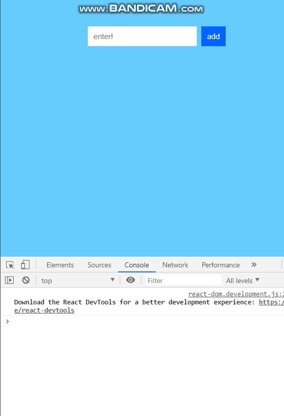
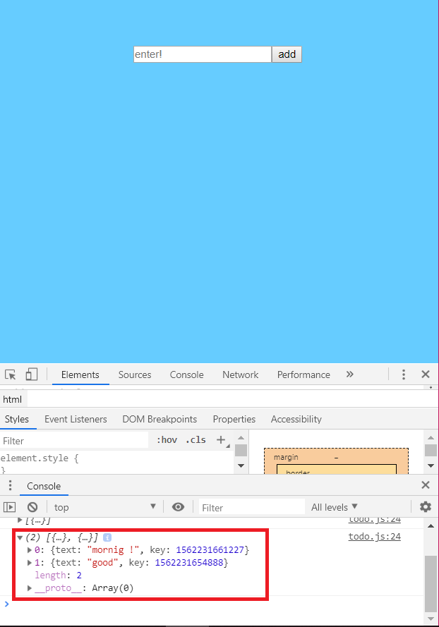
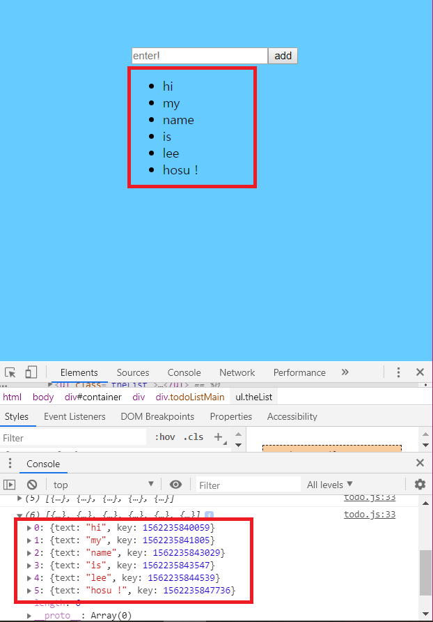
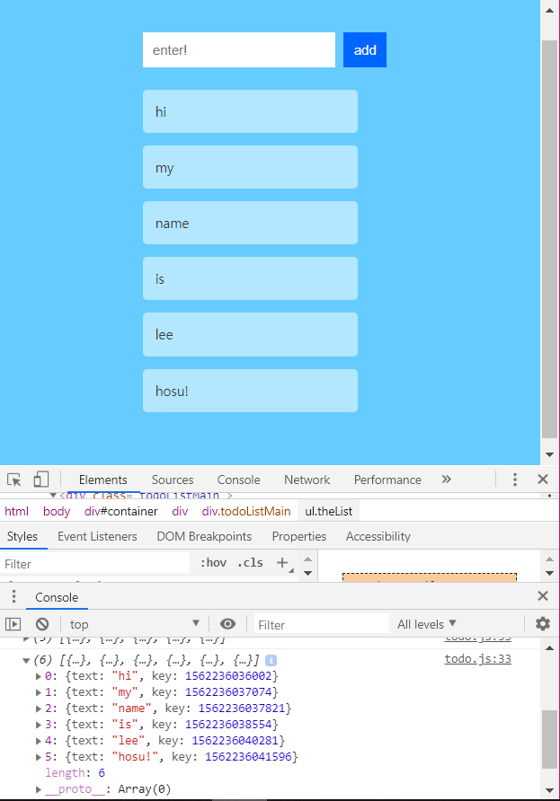

# 📚 Make ToDo List App

## OVERVIEW




## Start Stage
##### public/index.html
```html
<!DOCTYPE html>
<html lang="en">
  <head>
    <meta charset="utf-8" />
    <link rel="shortcut icon" href="%PUBLIC_URL%/favicon.ico" />
    <meta name="viewport" content="width=device-width, initial-scale=1" />
    <meta name="theme-color" content="#000000" />
   <link rel="manifest" href="%PUBLIC_URL%/manifest.json" />
   
    <title>ToDo List App</title>
  </head>
  <body>
    <div id="container"></div>
   
  </body>
</html>
```

##### src/index.js
```js
import React from "react";
import ReactDOM from "react-dom";
import "./index.css";

const destination = document.querySelector("#container");

ReactDOM.render(
    <div>
        <p> Hello !</p>
    </div>,
    destination
);
```

##### index.css
```css
body{
    padding : 50px;
    background-color: #66CCFF;
    font-family: sans-serif;
}

#container{
    display: flex;
    justify-content: center;
}
```

- 뼈대를 만든것에 불과하다

## 초기 UI 제작
##### src/todo.js
```js
import React, { Component } from "react";

class TodoList extends Component{
    render(){
        return (
            <div className = "todoListMain">
                <div className = "header">
                    <form>
                        <input placeholder = "enter!"></input>
                        <button type = "submit">add</button>
                    </form>
                </div>
            </div>

        );
    }
}
export default TodoList;
```
- `<input placeholder = "enter!"></input>` : 입력 필드 작성
- `<button type = "submit">add</button>` : button 생성
- 이 element들은 모두 TodoList라는 Component안에 존재하게 할 것이다.
- 이 Component를 index.js에서 참조해야 사용할 수 있다.
##### src/index.js
```js
import React from "react";
import ReactDOM from "react-dom";
import "./index.css";
import "./todo.js";
import TodoList from "./todo.js";

const destination = document.querySelector("#container");

ReactDOM.render(
    <div>
        <TodoList />
    </div>,
    destination
);
```
- `import TodoList from "./todo.js";`를 추가해 todo.js의 TodoList Component를 사용할 수 있게 한다.
- 참조한 TodoList Component를 사용하기 위해 `<TodoList />` 를 작성한다.

## 세부 내용 개발
- 초기 UI element를 보여주는 일은 쉬운 부분이다.
- 모든 비주얼과 데이터를 함께 묶는게 진짜 개발이다.

1. 아이템 추가
2. 아이템 표시
3. 스타일 적용
4. 아이템 삭제
5. 아이템 추가와 삭제 시 애니메이션 적용

### Add Item
- 첫번째로 해야 할 주된 작업은 이벤트 핸들러와 기본 폼 핸들러를 설정해 아이템이 추가될 수 있게 하는 일이다.

##### src/todo.js
`<form onSubmit = {this.addItem}>` : form에서 submit 이벤트를 리스닝하며, 이벤트가 발생하면 addItem 메소드를 호출한다.
- 이제 폼이 제출되면 호출될 addItem 이벤트 핸들러를 만든다.
```js
constructor(props){
        super(props);

        this.state = {
            items : []
        };

        this.addItem = this.addItem.bind(this);
}
```
- 여기서 state 객체는 복잡할 게 없다. 
- 단지 사용자가 입력하는 item을 저장할 배열인 `items`라는 속성을 정의했을 뿐이다.
- 사용자가 add button을 누르면 input element로부터 값을 읽어 items에 저장하게 하는 일이 남았다.
- input이라는 DOM에 접근하기 위해 `ref`를 사용한다.

```js
 <input ref = {(a) => this._inputElement = a} 
        placeholder = "enter!"></input>
```

- **input element의 참조를 _inputElement라는 속성에 저장한다.**
- 이 Component안의 input element에 접근하고 싶으면 _inputElement를 통해 할 수 있다는 의미이다.

```js
 addItem(e) {
        var itemArray = this.state.items;

        if (this._inputElement.value !== "") {
          var newItem = {
            text: this._inputElement.value,
            key: Date.now()
          };
       
          itemArray.push(newItem);

          this.setState({
              items : itemArray
          });

        }
         
        console.log(this.state.items);
           
        this._inputElement.value = "";
        e.preventDefault();
      }
```
- add 함수인데 여기서는 먼저 상태 객체에 있는 items의 현재 값을 저장하기 위해 itemArray라는 변수를 만들었다.
- 실제로는 입력된 텍스트와 고유 키 값을 포함하는 객체를 추가했다.

##### e.preventDefault();
- 이는 이벤트의 기본 동작을 막는다는 의미이다.
- 사용자가 form을 제출하면 기본적으로 page는 다시 roading되며 모든 사항이 초기화된다.
- 따라서 위의 메소드를 호출함으로써 그런 기본 동작을 막았다.




### View Item List
- 현재는 item을 console에서만 확인 할 수 있다.
##### src/todo.js
```JS
import TodoItems from "./TodoItems";
.
.
.
<TodoItems add={this.state.items}/>
```

##### src/TodoItems.js
```js
import React, { Component } from "react";

class TodoItems extends Component{
    createTasks(item){
        return <li key = {item.key}> {item.text} </li>
    }

    render(){
        var todoEntries = this.props.add;
        var listItems = todoEntries.map(this.createTasks);

        return(
            <ul className = "theList">
                {listItems}
            </ul>
        );
    }
}

export default TodoItems;
```
- render 함수에서는 add 속성을 통해 item을 받아 JSX와 html 식의 코드로 바꿔준다.
- `createTasks` 라는 커스텀 함수를 사용.
- listItems 변수에 저장된 값은 화면에 출력할 contents를 담고 있는 li element의 배열이다.
- 여기서 key 속성의 값을 각 element에 설정함으로써 react가 element를 추적하기 쉽게 했다.



### Use CSS
- 코딩의 완성은 스타일이다.

##### src/TodoList.css
```css
.todoListMain .header input {
    padding: 10px;
    font-size: 16px;
    border: 2px solid #FFF;
  }
  .todoListMain .header button {
    padding: 10px;
    font-size: 16px;
    margin: 10px;
    background-color: #0066FF;
    color: #FFF;
    border: 2px solid #0066FF;
  }

  .todoListMain .header button:hover {
    background-color: #003399;
    border: 2px solid #003399;
    cursor: pointer;
  }

  .todoListMain .theList {
    list-style: none;
    padding-left: 0;
    width: 255px;
  }

  .todoListMain .theList li {
    color: #333;
    background-color: rgba(255,255,255,.5);
    padding: 15px;
    margin-bottom: 15px;
    border-radius: 5px;
  }
```



### Delete Item
- 클릭할 item은 TodoItem.js에 구현되어 있다.
- state 객체에 item을 채우는 실제 코드는 todo.js에 있다.
- 먼저 `createTasks` 구문을 수정한다.

##### src/TodoItems.js
```js
 createTasks(item){
        return <li onClick={() => this.delete(item.key)}
         key = {item.key}> {item.text} </li>
    }
```
- 여기서는 단순히 click 이벤트를 리스닝하며, delete라는 이벤트 핸들러에 연결했다.

- delete event 핸들러를 정의한다.

##### src/TodoItem.js
```js
constructor(props){
        super(props);

        this.createTasks = this.createTasks.bind(this);
    }

    delete(key){
        this.props.delete(key);
    }
```
- item의 key를 인자로 받는 delete 함수를 정의했다.
- 또한 생성자를 추가해 그 안에서 this를 명시적으로 바인딩했다.
- 주목해야할 점은 **delete 함수가 실제로 삭제 작업을 하지 않는다**는 것이다.
- 속성을 통해 this 컴포넌트에 전달된 또 다른 delete 함수를 호출한다.

##### src/todo.js

```js
<TodoItems add={this.state.items}
          delete = {this.deleteItem} />
```
- 이렇게 함으로써 TodoItem Component는 이제 delete라는 속성을 인지하게 됐다.
- 이는 또한 TodoList에 추가할 삭제 함수를 실제로 연결 시킨다는 의미이다.
- 이제 남은건 deleteItem 함수를 만드는 것이다.

```js
 deleteItem(key){
    var filteredItems = this.state.items.filter(functio(item) {
       return (item.key !== key);
    });
    this.setState({
        items: filteredItems
    });
}
```
- click된 item으로부터 key를 받아 filter 메소드로 전달해 현재 저장하고 있던 key와 비교한다.
- 그 후 새로운 배열이 만들어져 state 객체의 items 속성에 지정된다.
```js
this.deleteItem = this.deleteItem.bind(this);
```
- 마지막으로 할 일은 this에 대한 통상적인 binding 작업이다.
