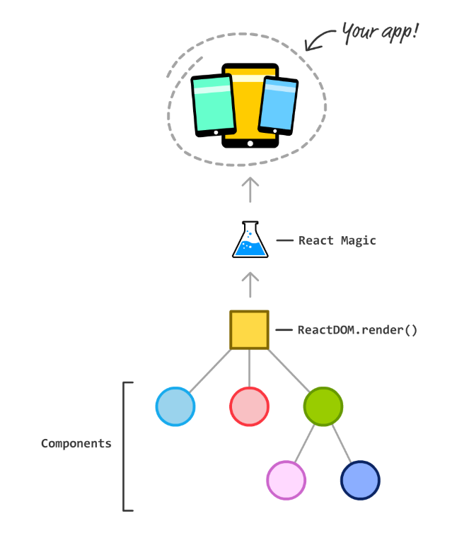
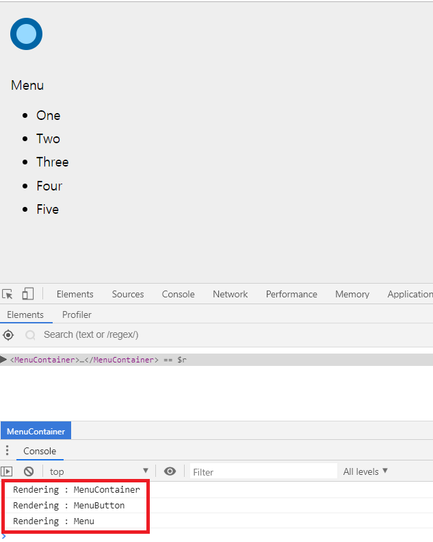
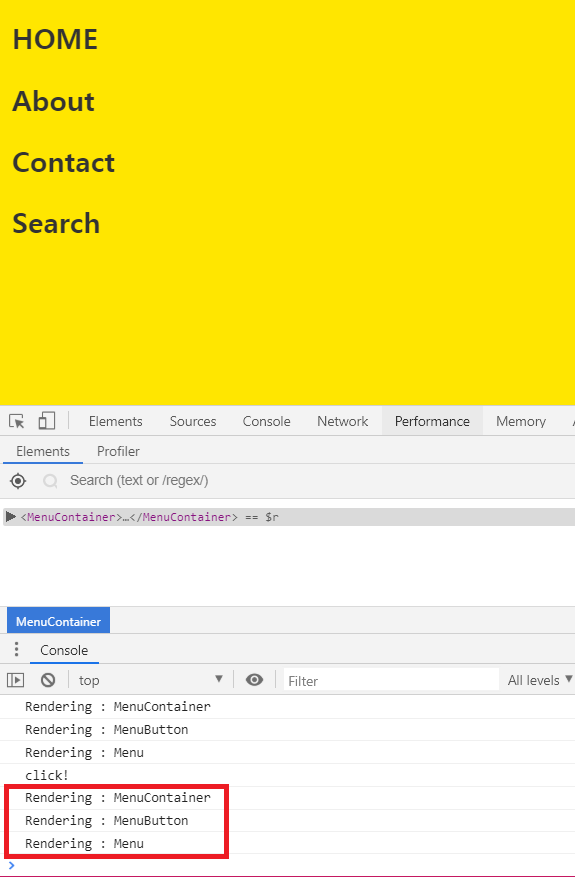
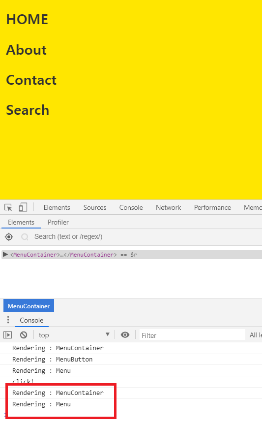

# 🔧 Protect Unnecessary Rendering

> React가 많은 힘든 일을 처리하고 있지만 각 Component의 render 메소드가 필요할때만 호출되게하는것이 가장 크게 신경써야할 부분이다.

## 'Render', Who are you?
- render 메소드의 공식적인 역할은 간단하다.
- 바로 각 Component를 보여주는 일과 부모 Component로 return하기 위한 JSX 생성을 돕는 일이다.



- 위의 과정을 보게되면 `RenderDOM.render()`를 호출하면 모든 JSX가 브라우저에서 보일 HTML, CS, JS로 변환된다.
- render 메소드의 호출은 일종의 **자동 처리**와 같은데 아래의 3가지 경우이다.
    1. Component의 속성이 갱신될 경우
    2. Component의 상태 속성이 갱신될 경우
    3. 부모 Component의 render 메소드가 호출될 경우
    - 상황에 따라 다르지만 위의 3가지의 경우에 따라 자동 호출된다.

- **render 메소드가 호출되는 것과 DOM이 최종적으로 갱신되는 것은 서로 다른 일이다.**

## Optimization of Call the Render
- 반드시 필요한 경우에만 render 메소드가 호출되게 하는 방법을 알아보자.

#### Example
- 이전에 공부하였던 [16장 Slide Menu](https://github.com/leehosu/react-tutorial/blob/master/Training/SlideMenu.md)를 참고하여 진행한다.

- render 수서를 확인해보기 위해 `console.log` 호출 로직을 추가한다.

##### src/MenuConatiner.js
```js
.
.
render(){
    console.log("Rendering : MenuContainer");
    return (
.
.
```

##### src/MenuButton.js
```js
.
.
render(){
    console.log("Rendergin : MenuButton");
.
.

```

##### src/Menu.js
```js
.
.
render() {
    console.log("Rendering : Menu");
.
.
```
- 모두 추가한 후 브라우저에서 앱을 실행시키고 개발자 도구를 열어 확인해본다.



- 확인 한 후 button을 클릭해 메뉴를 불러온 후 console 창을 확인해본다.



- 그 후 또 다시 화면을 눌러 menu를 사라지게 만들게 되면 또 똑같이 render 메소드가 호출되며 rendering 한다.
- MenuContainer의 render 메소드를 보면 MenuButton Component를 호출하면서 값이 변경되지 않을 속성을 전달하고 있다.
`<MenuButton handleMouseDown={this.handleMouseDown} />`
- handleMouseDown 메소드의 값, 즉 메소드 코드 자체는 메뉴가 열리거나 닫힐때마다 매번 바뀌지 않는다. 그럼에도 render 메소드가 호출되는 이유는 부모인 MenuContainer때문이다.
- **부모의 render 메소드가 호출되면 모든 자식 Component의 render 메소드가 호출된다.**

#### shouldComponentUpdate 재정의
- 이 메소드는 render 메소드 호출 직전에 호출되며, 이 메소드가 false를 return하게 하면 render 메소드의 호출을 막을 수 있다.

##### src/MenuButton.js
```js
.
.
class MenuButton extends Component{
   shouldComponentUpdate(nextProps, nextState){
        if(nextProps.handleMouseDown === this.props.handleMouseDown){
            return false;
        } else {
            return true;
        }
    }
.
.
```



- 보다시피 MenuButton Component의 render 메소드가 호출되지 않는것을 확인 할 수 있다.
- 유일하게 전달되는 속성인 handleMouseDown의 값이 바뀌지 않은 경우에만 render를 호출하지 않게 개선했다.

#### PureComponent 사용
- shouldComponentUpdate를 사용해 속성이나 상태의 변경여부를 확인하게 하는 방법이 있고, 자동으로 처리해주는 특별한 유형의 `PureComponent`를 사용할 수 있다.

```js
class Text extends PureComponent{
    render (){
        return (
            <h1> hellow </h1>
        )
    }
}
```
- 이 Component는 `PureComponent`를 상속 받음으로써 속성이나 상태가 변경되었을 때에만 render를 호출하게 된다.

> 왜 PureComponent를 기본으로 사용하지 않을까?
>> PureComponent는 비교적 얕은 비교를 수행한다. 즉, 속성이나 상태의 변경 사항을 완벽하게 확인하지 않는다. 또, 성능에 문제가 있는데, 부모 Component가 rendering 될때마다 자식 Component의 render여부를 결정하기 위해 매번 수행되므로 성능이 떨어진다.

