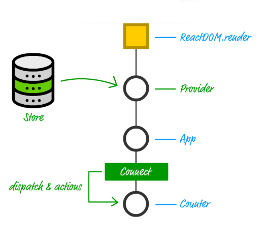
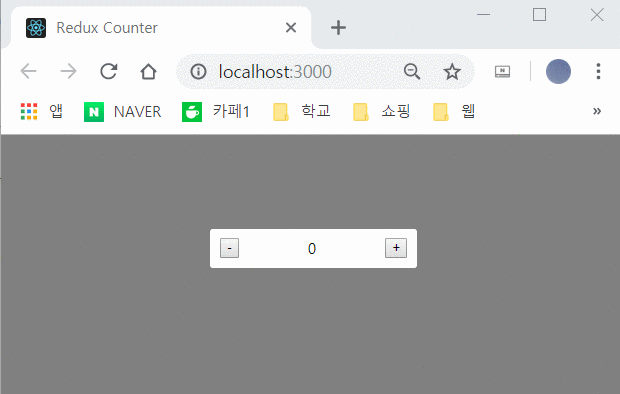
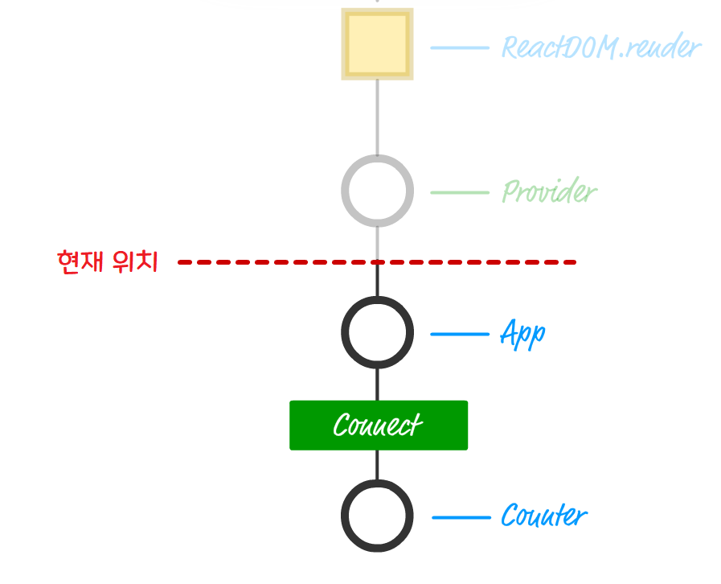

# 👍 React and Redux

- Redux의 작동 원리를 이해했으니, 이제 좀 더 발전된 주제로 넘어간다.


- 여기서 중요한 건 Component가 상태를 관리하고 속성의 형태로 전달하는 책임을 맡는다는 것이다.
- 보통의 앱에서는 상태의 생서으 처리, 전달 과정이 아주 많이 일어나기 때문에 어떤 Component는 상태 변경을 일으키고 또 다른 어떤 Component는 그 상태에 반응한다.

> Component들 사이에 무분별하게 데이터를 주고받으면서 발생할 수 있는 문제점
    1. 의존성은 코드 관리를 어렵게 만든다.
    2. 상태가 변하거나 속성이 전달될 때마다 관련된 모든 Component가 매번 다시 Rendering 된다. 이를 방지하기 위해 `shouldComponentUpdate` 메소드를 재정의하거나 `PureComponent`를 사용하는 전략이있다. 하지만 이 두 방법 모두 앱의 데이터가 증가함에 따하 동기화 작업이 번거롭다.
    3. Component 계층도는 UI에 대한 것이지, 데이터에 대한 것이 아니다. Component를 배치라고 끼워 넣는 작업은 UI가 작고 관리가 용이하게 분리시키는 좋은 방법이다.

- 위와 같은 문제들을 해결 할 수 있는 게 Redux이다.


- Redux를 사용하면 각 Component에 걸쳐 분산돼 있는 애플리케이션의 상태를 모두 데이터 Store에 저장할 수 있게 한다.
- 이 접근 방법은 Component 계층도의 위아래로 전달 시키지 않아도 된다.
- 이는 불필요한 rendering을 없앨 목적으로 해당 Component에만 데이터가 전달되게 하는 관리 작업의 과부하는 줄여준다.


- 스토어를 제외하면 앞으로 여전히 `action`과 `reducer`, 그리고 `redux` 파티에 참여하는 다른 조각들에 대해 작업할 것이다.

#### React state Control that Use Redux
- React APP에 Redux를 적용하는 방법은 React 코드에서 Redux API를 호출하기만 하면 된다.
    1. App이 `Redux store`를 참조할 수 있게 한다.
    2. `store`의 데이터를 필요로 하는 component에 액션 생성자, 디스패치 함수, 상태를 속성으로 매핑한다.



- 위의 사진을 보게 되면 크게 2단계를 유의 해야한다.
    1. 첫 번째 단계는 리덕스 스토어로 접근하는 방법을 제공하는 일이며, 이는 `Provider` Component가 담당한다.
    2. 두 번째 단계는 어떤 Component든 `dispatch`와 `action`에 접근 가능하게 하는 일이며, 이는 `Connect` Component가 담당한다.

##### Provider Component
- `Provider` component는 react app에서 redux를 사용하기 위한 관문 역할을 한다.
- **`Provider`는 `store`에 대한 참조를 저장하며 app 안의 모든 Component에게 `store`로의 접근 방법을 보장한다.**
- 이는 `Provider`가 Component 계층도에서 최상위 Component여야 가능하다.

##### Connect Component
- 전통적인 의미의 Component가 아닌, 고차원 컴포넌트(Higher Order Component)이다.
- `HOC`는 기존 Component를 래핑하고 `HOC`고유의 기능을 추가로 주입함으로써 그 Component의 기능성을 확장시키는 일관된 방법을 제공한다.
- 이를 쉽게 `extends` 키워드를 사용해 ES6 클래스로 하는 일과 비슷하다.

> Provider와 Connect HOC는 어떤 리액트 앱이라도 완전히 효율적이고 놀라운 리덕스 고유의 애플리케이션 상태 관리 방식을 쉽게 이용할 수 있게 하는 공생 관계이다.


### Overview



#### Start
- `create-react-app reduxcounter`
- `cd reduxcounter` 
- `npm install redux` : redux 자체 패키지를 설치한다.
- `npm install react-redux` : redux 의존성 패키지를 설치한다.

#### App build
> 파일위치 : reduxcounter/public/index.html
```html
<!DOCTYPE html>
<html lang="en">
<head>
    <meta charset="UTF-8">
    <title>Redux Counter</title>
</head>
<body>
    <div id = "container">]
        
    </div>
</body>
</html>
```
- container라는 id값을 가진 div 앨리먼트가 하나있다라는 사실만 주목할 만하다.

> 파일 위치 : reduxcounter/src/index.js
```js
import React, { Component } from "react";
import ReactDOM from "react-dom";
import { createStore } from "redux";
import { Provider } from "react-redux";
import counter from "./reducer";
import App from "./App";
import "./index.css";

var destination = document.querySelector("container");

//store
var store = createStore(counter);

ReactDOM.render(
    <Provider store = {store}>
        <App />
    </Provider>,
    destination
);

```

- reducer를 인자로 받는 createStore 메소드를 사용해 redux sotre를 초기화했다.
- `<Provider store = {store}>` : 앱의 가장 바깥쪽 Component로써, 어떤 Component든 redux store와 그 관련 기능에 접근할 수 있게 보장한다.

> 파일 위치 : reduxcounter/src/reducer.js
```js
function counter(state, action){
    if(state === undefined){
        return { count : 0};
    }

    var count = state.count;

    switch(action.type){
        case "increase":
            return { count : count + 1};
        case "decrease":
            return { count : count -1 };
        default:
            return state;
    }
}

export default counter;
```
- counter 변수에 의해 참조되는 reducer를 만든다.
- 먼저 상태가 비어있다면 0으로 초기화되는 count 변수가 있고, increase와 decrease라는 두가지 `action`을 다룬다.




> 파일 위치 : reduxcounter/src/App.js
```js
import { connect } from "react-redux";
import Counter from "./Counter";

//redux 상태를 component 속성에 매핑
function mapStateToProps(state){
    return {
        countValue : state.count
    };
}

//action
var increaseAction = { type : "increase" };
var decreaseAction = { type : "decrease" };

//redux action을 component 속성에 매핑
function mapDispatchToProps(dispatch){
    return {
        increaseCount : function() {
            return dispatch(increaseAction);
        },
        decreaseCount : function() {
            return dispatch(decreaseAction);
        }
    };
}

//HOC
var connectedComponent = connect(
    mapStateToProps,
    mapDispatchToProps
)(Counter);

export default connectedComponent;  
```
- 이 코드의 주 목적은 모든 redux에 특정적인 후크를 react에서 사용할 수 있는 무언가로 바꾸는 것이다.
- 정확히는 모든 redux 후크를 mapStateToProps와 mapDispatchToProps라는 두 함수를 통해 쉽게 소비할 수 있는 속성의 형태로 바꿔 제공한다라는 의미이다.

```js
function mapStateToProps(state){
    return {
        countValue : state.count
    };
}
```
- 이 함수는 모든 `store` 갱신 작업을 구독하므로, `store`에 어떤 변경이 일어나도 호출된다.
- 그러면 Component의 속성으로 전달할 스토어 데이터를 담는 객체를 return한다.
- **countValue라는 속성을 담는 객체로서, 이 속성은 스토어의 현재 count 속성 값을 나타낸다.**

- 그 다음에 필요한 것은 Component가 `액션 생성자`와 `action`에, 속성의 형태로 접근하게 하는 일이다.

```js
var increaseAction = { type : "increase" };
var decreaseAction = { type : "decrease" };

//redux action을 component 속성에 매핑
function mapDispatchToProps(dispatch){
    return {
        increaseCount : function() {
            return dispatch(increaseAction);
        },
        decreaseCount : function() {
            return dispatch(decreaseAction);
        }
    };
}
```
- mapDispatchToProps에서는 Component가 `store`를 변경시키는 `action`에 `dispatch` 가능한 두 함수의 이름을 담은 객체를 리턴한다.
- increaseCount 함수는 increase 유형의 `action`에 `dispatch`해준다.
- decreaseCount 함수는 decrease 유형의 `action`에 `dispatch`해준다.

- 이제 남은 것은 어떤 Component든 이들 속성을 받아 사용할 수 있게 보장하는 일인데 이것이 바로 `connect` 함수가 등장하는 부분이다.

```js
//HOC
var connectedComponent = connect(
    mapStateToProps,
    mapDispatchToProps
)(Counter);
```
- 이 함수는 앞에서 얘기했던 Connect HOC를 생성시켜준다.
- mapStateToProps와 mapDispatchToProps 함수를 인자로 받으며, 이를 모두 Counter Component로 전달한다.

```js
import React, { Component } from "react";

class Counter extends Component{
    render(){
        return(
            <div className="container">
                <button classNmae = "buttons"
                        onClick = {this.props.decreaseCount}> - </button>
                <span>{this.props.countValue}</span>
                <button classNmae = "buttons"
                        onClick = {this.props.increaseCount}> + </button>
                
            </div>
        );
    }
}

export default Counter;
```
- 이미 Connect HOC가 속성과 여타 기법을 Counter Component로 내리는 원리를 알고 있으니 여기서는 플러스나 마이너스 button을 클릭했을 때 counter의 값을 보여주거나 적절한 함수를 호출하기 위해 해당 속성을 사용하는 모습이다.

```css
body{
    margin : 0;
    padding : 0;
    font-family: sans-serif;
    display: flex;
    justify-content: center;
    background-color: gray;
}

.container{
    background-color: #FFF;
    margin : 100px;
    padding: 10px;
    border-radius: 3px;
    width: 200px;
    display: flex;
    align-items: center;
    justify-content: space-between;
}

.buttons{
    background-color: transparent;
    border: none;
    font-size: 16px;
    font-weight: bold;
    border-radius: 2px;
    transition: all .15s ease-in;
}

.buttons:hover:nth-child(1){
    background-color: #F45B69;
}

.buttons:hover:nth-child(3){
    background-color: #C0DFA1;
}
```
- 이렇게 css까지 적용하고 `npm start`를 실행하면 끝이다.

### 정리
>- Redux는 여러 측면에서 React의 단점을 해결하게 설계되었으며, React는 이를 종종 장점으로 내세우기도 한다.
>- 하지만 데이터를 다루는 모든 상황에서 반드시 리덕스를 써야하는 것은 아니다. 