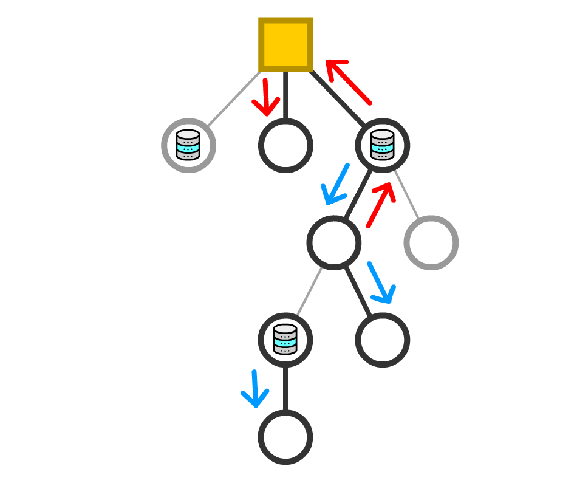
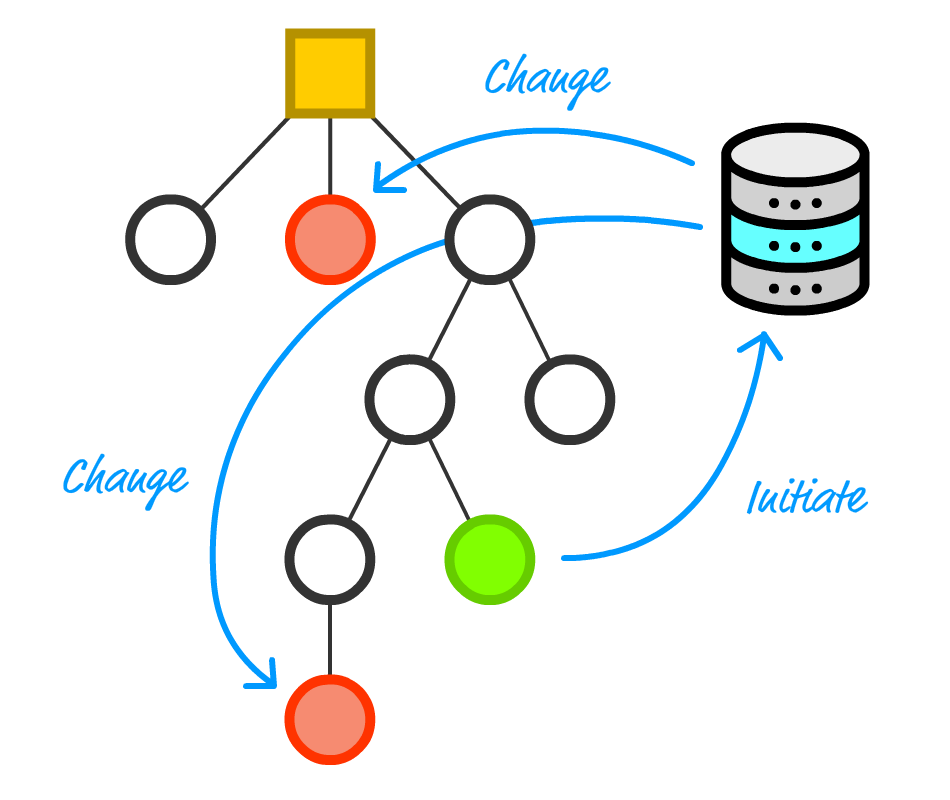
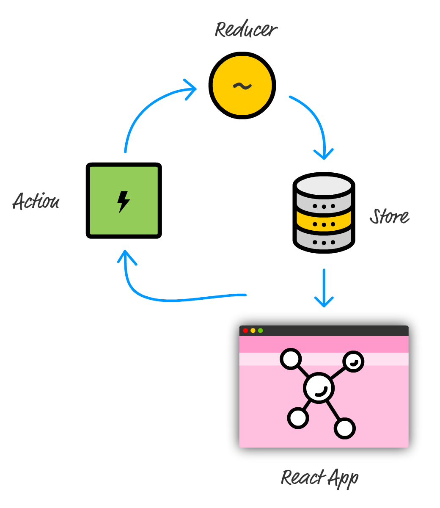

# 👍 React and Redux

- Redux의 작동 원리를 이해했으니, 이제 좀 더 발전된 주제로 넘어간다.

- 여기서 중요한 건 Component가 상태를 관리하고 속성의 형태로 전달하는 책임을 맡는다는 것이다.
- 보통의 앱에서는 상태의 생서으 처리, 전달 과정이 아주 많이 일어나기 때문에 어떤 Component는 상태 변경을 일으키고 또 다른 어떤 Component는 그 상태에 반응한다.

> Component들 사이에 무분별하게 데이터를 주고받으면서 발생할 수 있는 문제점
    1. 의존성은 코드 관리를 어렵게 만든다.
    2. 상태가 변하거나 속성이 전달될 때마다 관련된 모든 Component가 매번 다시 Rendering 된다. 이를 방지하기 위해 `shouldComponentUpdate` 메소드를 재정의하거나 `PureComponent`를 사용하는 전략이있다. 하지만 이 두 방법 모두 앱의 데이터가 증가함에 따하 동기화 작업이 번거롭다.
    3. Component 계층도는 UI에 대한 것이지, 데이터에 대한 것이 아니다. Component를 배치라고 끼워 넣는 작업은 UI가 작고 관리가 용이하게 분리시키는 좋은 방법이다.

- 위와 같은 문제들을 해결 할 수 있는 게 Redux이다.

- Redux를 사용하면 각 Component에 걸쳐 분산돼 있는 애플리케이션의 상태를 모두 데이터 Store에 저장할 수 있게 한다.
- 이 접근 방법은 Component 계층도의 위아래로 전달 시키지 않아도 된다.
- 이는 불필요한 rendering을 없앨 목적으로 해당 Component에만 데이터가 전달되게 하는 관리 작업의 과부하는 줄여준다.

- 스토어를 제외하면 앞으로 여전히 `action`과 `reducer`, 그리고 `redux` 파티에 참여하는 다른 조각들에 대해 작업할 것이다.
