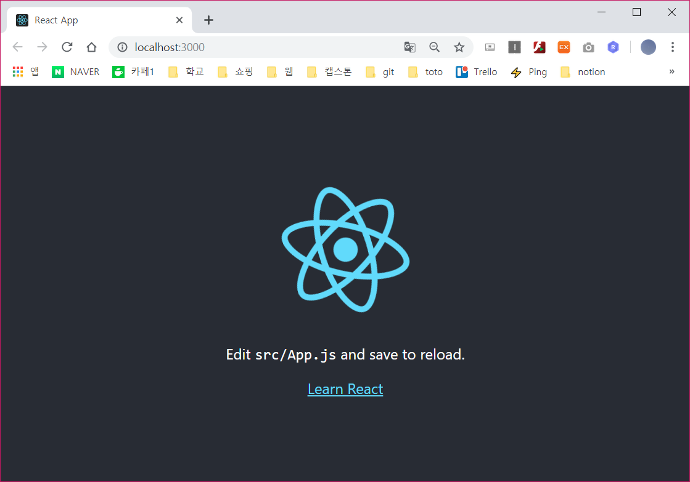
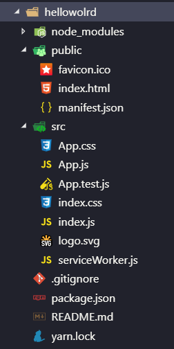
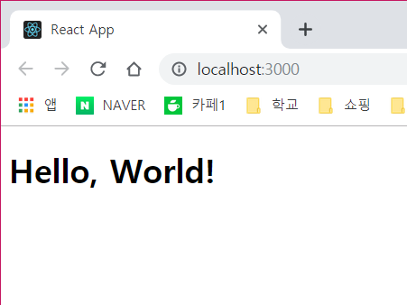
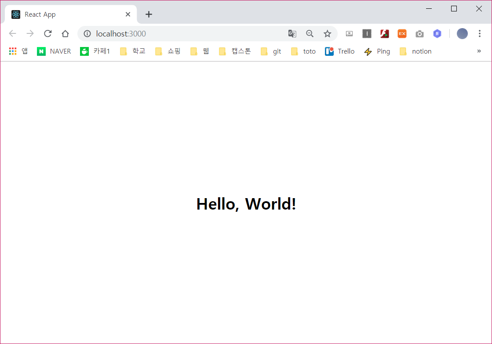
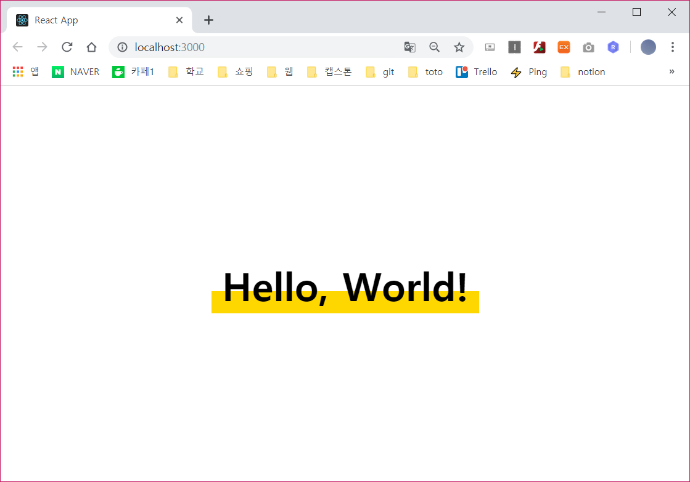
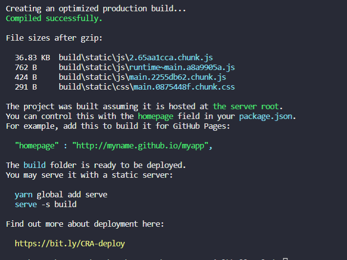

# 👶 React Start

> 이 장에서는 이제 React를 사용하기 위한 환경 구성에 대한 내용이다.

## Creact React의 첫 만남
- Create React라는 프로젝트는 react 개발 환경의 구성을 매우 단순화 시켰다.
- bash을 실생한 다음에 명령어를 입력하면 설치가 된다.
`npm install -g create-react-app`

- 그 후 프로젝트 생성 명령을 실행한다.
`create-react-app helloworld`
`cd hellowolrd`
`npm start`
- 프로젝트가 빌드 되고 로컬 웹 서버가 구동됨으로써, 다음과 같이 실행된 화면을 볼 수 있다.



#### What's Happening?
- `creat-react-app helloworld` 를 실행한 후의 파일과 폴더구조는 아래와 같다.



##### public/index.html
- 여기서 브라우저에 로딩되었던 파일은 public/index.html이다.

```html
<!DOCTYPE html>
<html lang="en">
  <head>
    <meta charset="utf-8" />
    <link rel="shortcut icon" href="%PUBLIC_URL%/favicon.ico" />
    <meta name="viewport" content="width=device-width, initial-scale=1" />
    <meta name="theme-color" content="#000000" />
   <link rel="manifest" href="%PUBLIC_URL%/manifest.json" />
   
    <title>React App</title>
  </head>
  <body>
    <noscript>You need to enable JavaScript to run this app.</noscript>
    <div id="root"></div>
   
  </body>
</html>
```

- 여기서 중요한 부분은 root라는 값의 id를 가진 div element이다.
`<div id="root"></div>` : react app이 최종적으로 contents를 출력시키는 장소.

##### src/index.js
- 모든 JSX를 포함한 react app의 contents는 src 폴더 안에 있으며 그 시작점은 index.js이다.
```js
import React from 'react';
import ReactDOM from 'react-dom';
import './index.css';
import App from './App';
import * as serviceWorker from './serviceWorker';

ReactDOM.render(<App />, document.getElementById('root'));

serviceWorker.unregister();
```
- index.html안의 root element를 찾아오는 ReactDOM.render를 주목하자.
- import 구문은 JacaScript안에서 일종의 모듈(*앱의 기능을 분리한 작은 조각*)로 취급된다.

##### src/App.js
```js
import React from 'react';
import logo from './logo.svg';
import './App.css';

function App() {
  return (
    <div className="App">
      <header className="App-header">
        
        <p>
          Edit <code>src/App.js</code> and save to reload.
        </p>
        <a
          className="App-link"
          href="https://reactjs.org"
          target="_blank"
          rel="noopener noreferrer"
        >
          Learn React
        </a>
      </header>
    </div>
  );
}
export default App;
```
- App.js 파일에서도 당연히 React와 Component를 import하고 있다.
- `export default App` 이 부분은 다른 파일에서 App 모듈을 import 할 때 사용될 이름이다.

> 정리
- 모듈, import 구문, export구문은 앱 코드의 더 나은 관리를 위한 세부 항목이다.
- 하나의 거대한 파일에 모든 내용을 집어 넣는 것이 아니라, 연관된 코드와 자산끼리 분리하여 여러 파일로 나눈것이다.
- **어떤 파일을 참조 할 것인지, 어떤 파일을 다른 파일보다 먼저 로딩시켜야하는 지에 따라 신비로운 빌드 잡업이 다양한 방식으로 최적화 시킨 최종 결과물을 만들게 될 것이다.**

## HelloWorld App 개발
- 브라우저에 `Hello, World!` 를 보여주는 일을 할 것이다.
- 먼저 src 폴더 내에 있는 모든 파일을 삭제한다.
- 그 후 , index.js와 HelloWorld.js 파일을 만든다.

##### src/index.js
```js
import React from "react";
import ReactDOM from "react-dom";
import HelloWorld from "./HelloWorld";

ReactDOM.render(
    <HelloWorld />,
    document.getElementById("root")
);
```

- React와 ReactDOM을 import했고 ReactDOM.render에서 사용할 HelloWorld라는 Component도 import했다.

##### src/HelloWorld.js
```js
import React,{ Component } from "react";

class HelloWorld extends Component{
    render(){
        return (
            <div className = "helloContainer">
                <h1>Hello, World!</h1>
            </div>
        );
    }
}

export default HelloWorld;
```



- 여기까지 코딩하고 실행시키면 위와 같은 화면이 브라우저에 출력된다.

##### src/index.css
```css
body{
    display: flex;
    align-items: center;
    justify-content: center;
    min-height: 100vh;
    margin: 0;
}
```

##### src/index.js
``` 
import "./index.css "
```

- 브라우저로 출력시켜보면 마지막 변경 사항이 자동으로 반영된다.



- 여기서 HelloWorld Component만을 위한 새 CSS를 만들어본다.

##### src/HelloWorld.css
```css
h1{
    font-family: sans-serif;
    font-size : 56px;
    padding : 5px;
    padding-left: 15px;
    padding-right: 15px;
    margin : 0;
    background: linear-gradient(
        to bottom,
        white 0%,
        white 62%,
        gold 62%,
        gold 100%
    );
}
```
##### src/HelloWorld.js
``` 
import "./HelloWorld.css "
```



## 운영 버전 빌드하기
- 우리는 지금까지 개발 모드에서 앱을 빌드 해왔다.
- 개발 모드에서는 코드의 최소화도 하지 않았고, 쉬운 디버그를 위해 여러 장황한 설정하에서 작업했다.

`npm run build`

- 이 스크립트는 약간의 시간을 들여 최적화된 파일 세트를 생성시킨다.
- 실행이 완료되면 아래와 같은 메시지를 볼 수 있다.



- 빌드가 완료되면 서버에 배포하거나 serve라는 node 패키지를 사용해 local에서 test할 수 있다는 안내를 볼 수 있다.
