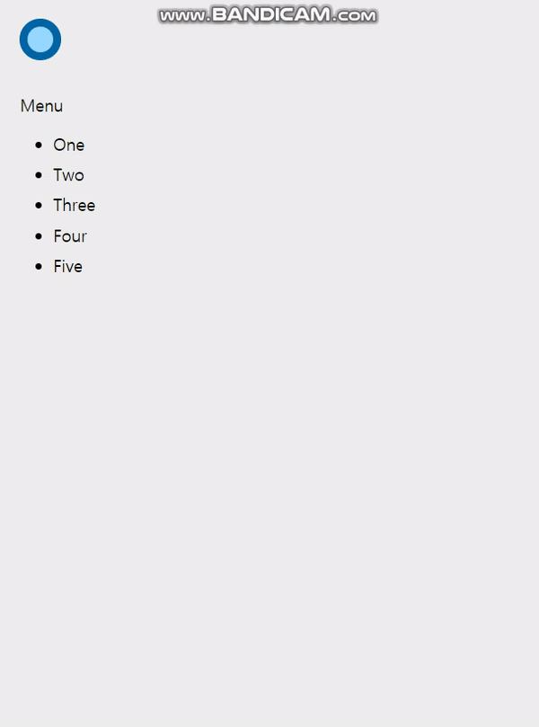
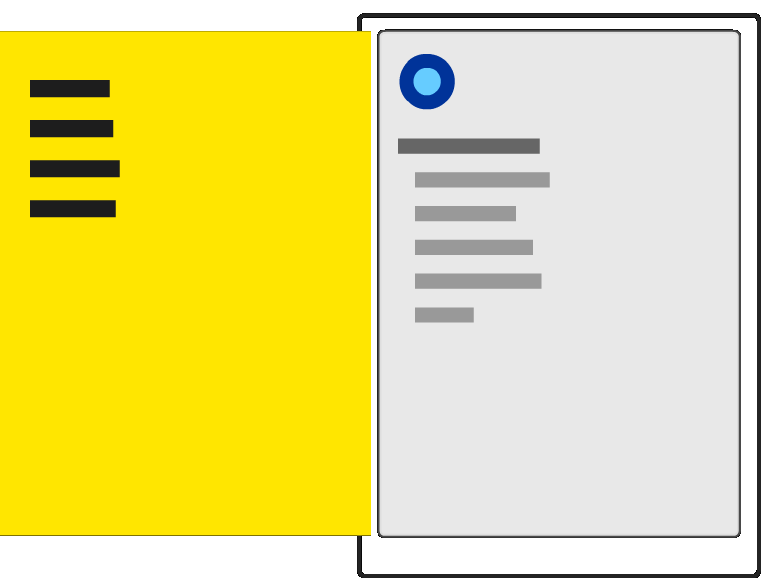
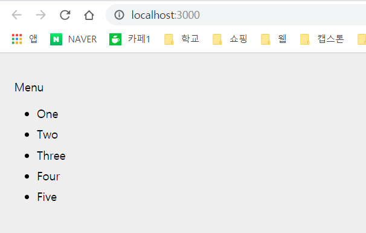

 # 📃Slide Menu

## OverView



 ## How It Works?



- 보시다시피 메뉴는 Contents 화면의 왼쪽에 존재하며, 호출되기 전까지는 그 자리에서 대기하고 있다.
- 메뉴의 위치를 화면에서 보이지 않을 때까지 최대한 왼쪽으로 이동시킴으로써 가능하다.
- 메뉴의 크기는 브라우저 창(또는 viewport)과 같다.
- 다음의 CSS를 적용시키면 된다.

```CSS
#theMenu{
    position : fixed;
    left : 0;
    top : 0;
    tranform : translate3d(-100vw,0,0);

    width : 100vw;
    height : 100vh;
}
```
- 메뉴의 위치를 fixed로 지정했다.
- 메뉴의 left와 top속성은 0으로 지정하고, tranform 속성에는 -100vw값이 전달된 translate3d 메소드를 지정함으로써, 메뉴 밖에 화면을 숨길 수 있다.
- `tranform : translate3d(100vw,0,0); : `화면 안으로 들어오라는 호출을 받으면 메뉴를 브라우저 창의 원래 위치까지 오른쪽으로 이동시킨다. 

## Ready To Development
- 위의 CSS로 만들었던 모든 사항들을 JSX로 만들어보자.

## Start
`create-react-app slidemenu`

##### public/index.html
```html
<!DOCTYPE html>
<html lang="en">
<head>
    <meta charset="UTF-8">
    <meta name="viewport" content="width=device-width, initial-scale=1.0">
    <meta http-equiv="X-UA-Compatible" content="ie=edge">
    <title>Slide Menu</title>
</head>
<body>
    <div id = "container"></div>
</body>
</html>
```
- container라는 최상위 div를 선언한다.

##### src/index.js
```js
import React from "react";
import ReactDOM from "react-dom";
import "./index.css";
import MenuContainer from "./MenuContainer";

const destination = document.querySelector("#container");

ReactDOM.render(
    <MenuContainer />,
    destination
)
```
- container자리에 MenuContainer Component를 불러온다.
- index.css와 MenuContainer Component를 import해준다.

##### src/MenuContainer.js
```js

import React, { Component } from "react";

class MenuContainer extends Component{
    render(){
        return (
            <div>
                <div>
                    <p> Menu </p>
                    <ul>
                        <li> One </li>
                        <li> Two </li>
                        <li> Three </li>
                        <li> Four </li>
                        <li> Five </li>
                    </ul>
                </div>
            </div>
        );
    }
}

export default MenuContainer;
```

##### src/index.css
```css
body{
    background-color: #EEE;
    font-family: sans-serif;
    font-size: 20px;
    padding : 25px;
    margin : 0;
    overflow: auto;
}

#container li{
    margin-bottom : 10px;
}
```

- 아무 문제가 없다면 브라우저에 아래와 같이 실행이된다.



## View The Menu and Hide The Menu
- 초기 앱을 준비했고 이제부터 메뉴를 구현한다.
    1. 버튼을 클릭하면 슬라이드 메뉴가 화면에 나타난다.
    2. 아무곳이다 클릭하면 슬라이드 메뉴는 사라진다.
- 일단 메뉴가 보이고 있는지, 숨겨져 있는지를 추적할 수 있는 상태를 관리해야한다.
- 이 상태는 버튼이나 메뉴가 클릭되면 갱신돼야 한다.
- 또한 상태는 메뉴와 버튼이 모두 접근할 수 있는 공통 위치에 존재해야한다.

##### src/MenuButton.js
```js
import React, { Component } from "react";
import "./MenuButton.css";

class MenuButton extends Component{
    render() {
        return(
            <button id = "roundButton"
                    onMouseDown = {this.props.handleMouseDown} />
        );
    }
}

export default MenuButton;
```
- roundButton이라는 이름의 button element를 만들었고, onMouseDown 이벤트를 handleMouseDown으로 참조하는 속성에 연결했다.

##### src/MenuButton.css
```css
#roundButton{
    background-color : #96D9FF;
    margin-bottom: 20px;
    width:50px;
    height: 50px;
    border-radius: 50%;
    border : 10px solid #0065A6;
    outline:none;
    transition: all .2s cubic-bezier(0, 1.26, .8, 1.28);
}

#roundButton:hover{
    background-color: yellow;
    cursor: pointer;
    border-color : #003557;
    transform: scale(1.2, 1.2);
}

#roundButton:active{
    border-color : #003557;
    background-color: #FFF;
}
```

- 그 후 MenuButton Component를 실제로 인스턴스화한다.

##### src/MenuContainer.js
```js
.
.
.
  return (
            <div>
                <MenuButton handleMouseDown={this.handleMouseDown} />
                <div>
                    <p> Menu </p>
                    <ul>
.
.
.

```

## Make the Menu
- 메뉴와 관련된 모든 사항을 책임질 Menu Component를 만든다.
- MenuContainer의 render 메소드에서 호출하는 코드를 먼저 만든다.

##### src/MenuContainer.js
```js
.
.
.
return (
    <div>
        <MenuButton handleMouseDown={this.handleMouseDown} />
        <Menu handleMouseDown = {this.handleMouseDown}
                menuVisibility={this.state.visible} />
.
.
.
```
- 전달하려는 첫번째 속성은 handleMouseDown이고 그 값은 handleMouseDown 이벤트 핸들러이다.
- 두번째 속성은 menuVisibility로서, 그 값은 visible이라는 상태 속성의 현재 값이다.

##### src/Menu.js
```js
import React, { Component } from "react";
import "./Menu.css";

class Menu extends Component{
    render() {
        var visibility = "hide";

        if(this.props.menuVisibility) {
            visibility = "show";
        }
        return (
            <div id = "flyoutMenu"
                onMouseDown = {this.props.handleMouseDown}
                className = {visibility}>

                <h2><a href = "/"> HOME </a></h2>
                <h2><a href = "/"> About </a></h2>
                <h2><a href = "/"> Contact </a></h2>
                <h2><a href = "/"> Search </a></h2>
            </div>
        );
    }
}

export default Menu;
```
- return 구문안에 있는 JSX에 주목해야 한다.
- flyoutMenu라는 div element가 있다. 
    - 이 div element안에는 onMouseDown이벤트가 발생하면 호출될 이벤트 핸들러를 handleMouseDown를 속성을 통해서 받는다.
- visility의 값은 hide나 show인데, 이는 state 객체의 visible에 의해 결정된 menuVisibility 속성의 값이 true인지에 따라 달라진다.

##### src/Menu.css
```css
#flyoutMenu{
    width: 100vw;
    height: 100vh;
    background-color: #FFE600;
    position : fixed;
    top : 0;
    left : 0;
    transition: transform .3s cubic-bezier(0, .52, 0, 1);
    overflow: scroll;
    z-index: 1000;
}

#flyoutMenu.hide{
    transform: translate3d(-100vw,0,0);
}

#flyoutMenu.show{
    transform: translate3d(0vw,0,0);
    overflow: hidden;
}

#flyoutMenu h2 a{
    color : #333;
    margin-left: 15px;
    text-decoration: none;
}

#flyoutMenu h2 a:hover{
    text-decoration: underline;
}
```
