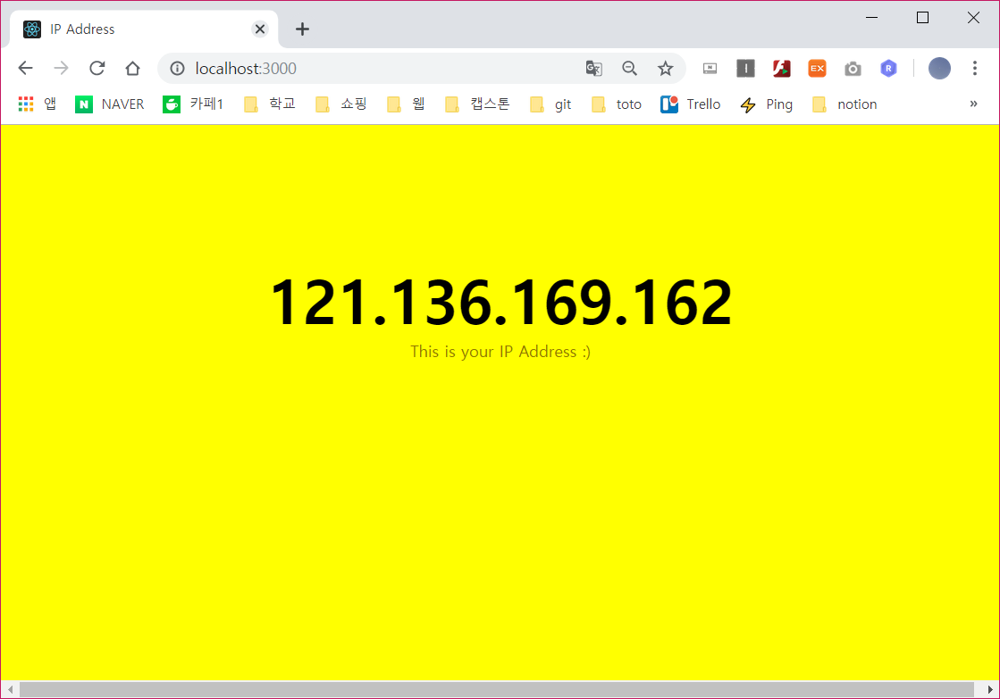

# 💥 Use External Data

> 오늘날 웹앱에서 외부 데이터를 다루는 방식은 상당히 표준화되었으며, 다음의 순서를 갖는다.
1. 앱이 원격 서비스에게 데이터를 요청한다.
2. 원격 서비스는 요청을 수신하고 요청된 데이터를 돌려보낸다.
3. 앱이 그 데이터를 받는다.
4. 앱은 받은 데이터를 가공해 사용자에게 보여준다.

- 어떤 사이트든 처음 들어가면 페이지를 로딩하고 첫 데이터를 화면에 보여줄 것이다.
- 보통의 경우 첫 페이지의 데이터 용량을 작게 유지하기 위해 한 번에 전체를 다운로드 하지 않는다.
- 페이지가 완전히 초기 로딩되거나 사용자가 상호작용을 시작한 다음에야 추가로 필요한 데이터를 서버로부터 다운로드해 보여준다.
- 이는 페이지를 refresh 해야하거나, 또는 현재 상태를 잃지 않아도 가능한 일이다.

## 웹 요청에 대한 기초
- 인터넷은 서로 연결된 엄청난 수의 컴퓨터, 즉 서버들로 이루어진다.
- 브라우저는 요청을 전송하고 , 서버로부터 응답을 받으며 일을 처리한다.
- 이 모든 통신 과정은 `HTTP 프로토콜` 때문에 가능하다.

- HTTP는 브라우저, 또는 그런 종류의 클라이언트와 인터넷의 서버가 통신 할 수 있는 공통의 언어를 제공한다.
- 사용자를 대신해 브라우저가 HTTP를 사용해 만드는 요청을 `HTTP Request`라고 하며 새 페이지가 로딩될때까지 유지된다.

##### HTTP 요청 예시
- 다음은 사용자 정보를 얻기 위한 HTTP 요청이다.

```
GET /user
Accept : application/json
```

- 위 요청에 대한 응답은 아래와 같다.
```
200 OK
Content-Type : application/json

{
    "id" : "hosu",
    "url" : "http:https://www.test.com"
}
```

- 이렇게 오고가는 일이 여러 번 일어나는데, **자바스크립트에서 완전히 지원한다.**
- 이렇게 페이지를 다시 로딩하지 않고도 비동기식 요청과 데이터 처리를 수행하는 기술을 Ajax라고 하며, 이는 비동기식 js와 XML의 줄임말이다.
- 자바스크립트에서 HTTP 요청을 보내거나 받는 책임을 지는 객체는 `XMLHttpRequest`인데 이 객체는 웹 요청에 있어 중요한 작업을 한다.
    1. 서버로 요청을 전송한다.
    2. 요청의 상태를 확인한다.
    3. 응답을 수신하고 파싱한다.
    4. 요청의 상태와 상호작용할 수 있게 하는, readystatechange라는 이벤트를 리스닝한다.

## React Time!
- 첫 단계는 새 리액트 앱을 생성 시키는 일이다.
- 터미널에서 새 프로젝트가 생성될 위치로 이동하고, 명령을 실행한다.
`create-react-app ipaddress`

- 제일 먼저 프로젝트가 생성되면 src 폴더 내의 파일을 전부 삭제한다.
- 그 후 public의 index.html을 수정하자.

##### public/index.html
```html
<!DOCTYPE html>
<html lang="en">
  <head>
    <meta charset="utf-8" />
    <title>IP Address</title>
  </head>

  <body>
    <div id="container"></div>
  
  </body>
</html>
```
- 여기서는 container라는 이름의 div element를 만드는 것이 전부다.
- 그 다음에 src 폴더로 이동해 index.js를 만든다.

##### src/index.js
```js
import React from "react";
import ReactDOM from "reacr-dom";
import "./index.css";
import IPAddressContainer from "./IPAddressContainer";

var destination = document.querySelector("#container");

ReactDOM.render(
    <div>
        <IPAddressContainer />
    </div>,
    destination
);
```
- 이 스크립트는 앱의 진입점이며 React,ReactDOM,CSS 파일, IPAddressContainer Component를 표준적인 방법으로 import한다.
- 시각적인 효과를 주기 위해 src 폴더안에 index.css 파일을 추가한다.

##### src/index.css
```css
body {
    background-color: yellow;
}
```

## IP 주소 가져오기
- 가장 중요한 웹 서비스로부터 IP주소를 가져올 Component를 만드는 일이다.
- 가져온 IP 주소는 상태에 저장할 것이며, IP 주소가 필요한 어떤 Component에게는 그 상태를 속성으로 공유할 것이다.

##### src/IPAddressContainer.js
```js
import React, { Component } from "react";

var xhr;
class IPAddressContainer extends Component {
    constructor(props){
        super(props);

        this.state = {
            ip_address : "..."
        };

        this.processRequest = this.processRequest.bind(this);
    }

    componentDidMount(){
        xhr = new XMLHttpRequest();
        xhr.open("GET", "https://ipinfo.io/json", true);
        xhr.send();

        xhr.addEventListener("readystatechange", this.processRequest, false);
    }

    processRequest(){
        if(xhr.readyState === 4 && xhr.status === 200){
            var response = JSON.parse(xhr.responseText);

            this.setState({
                ip_address : response.ip
            });
        }
    }
    render(){
        return (
            <div>{this.state.ip_address}</div>
        );
    }
};

export default IPAddressContainer;
```
- 위 코드는 HTTP 통신을 위해 코딩되었다.
- `readystatechange` : readyState 속성 값이 변경될 때마다 자동으로 호출될 함수 또는 함수명을 저장한다.
- `readyState` : XMLHttpRequest 객체의 상태를 가지고 있고 0부터 4까지의 값을 가진다.

| readyState 값 | 의미 |
|:---:|:---:|
| `0` | 요청이 초기화되지 않음 |
| `1` | 서버와 연결되었음 |
| `2` | 요청이 받아 들여짐 |
| `3` | 요청이 진행 중 |
| `4` | 요청이 완료되고 응답을 받음 |

- `state` : 200 - 정상 / 404 - 페이지 오류

```js
   componentDidMount(){
        xhr = new XMLHttpRequest();
        xhr.open("GET", "https://ipinfo.io/json", true);
        xhr.send();

        xhr.addEventListener("readystatechange", this.processRequest, false);
    }
```
- ComponentDidMount라는 생명주기 메소드가 호출되면 HTTP 요청이 만들어져 ipinfo.io라는 웹 서비스에 전송된다.

```js
    processRequest(){
        if(xhr.readyState === 4 && xhr.status === 200){
            var response = JSON.parse(xhr.responseText);

            this.setState({
                ip_address : response.ip
            });
        }
    }
```
- ipinfo 서비스의 응답이 왔다면 processRequest 함수를 호출해 결과를 처리하면 된다.
- 그 다음엔 상태에 저장된 IP 주소를 참조하게 render 메소드를 수정한다.

```js
   render(){
        return (
            <div>{this.state.ip_address}</div>
        );
    }
```

> 현재 429 Error가 나오면서 실행이 안되고 있다. 빠른 시일내에 해결법을 찾아보겠습니다.
>> 해결 : ipinfo가 하루에 request 요청양이 1000회로 제한되어있어 다른 ip find 사이트를 이용하였습니다. http://ip-api.com/json

## 시각적 요소 추가하기
- HTTP 요청을 다루는 Component를 만들었으며 정상적으로 IP 주소를 가져오는 것 까지 확인했다.
- 오직 스타일만을 위한 별도의 Component를 만든다.

##### src/IPAddress.js
```js
import React, { Component } from "react";

class IPAddress extends Component{
    render(){
        return (
            <h1>{this.props.ip}</h1>
            <p> This is your IP Address :) </p>
        );
    }
}

export default IPAddress;
```
- IP주소를 원하는 모습으로 만들고 추가로 text를 보여줄 IPAddress라는 Component를 만들었다.
- h1 태그안에는 ip라는 속성에 IP 주소를 넣으며, p태그를 사용해 추가로 text를 보여준다.

##### src/IPAddress.css
```css
h1 {
    font-family: sans-serif;
    text-align: center;
    padding-top:140px;
    font-size:60px;
    margin : -15px;
}

p{
    font-family: sans-serif;
    color : #907400;
    text-align: center;
}
```
- 이 CSS 를 참조하기 위해 IPAddress.js에 추가한다.
`import "./IPAddress.css";`

- IPAddress Component 사용하여 IP주소를 전달해야하기 때문에 IPAddressContainer.js에 IPAddress Component 를 참조 시켜준다.
`import IPAddress from "./IPAddress.js";`

- 마지막으로 ip라는 속성을 정의하고 여기에 ip_address라는 상태 변수를 설정해 IPAddress Component를 호출한다.
`<IPAddress ip = {this.state.ip_address} />`

- 이렇게 함으로써 IP 주소는 IPAddress Component의 render 메소드로 들어가 스타일이 적용돼 브라우저에 보이게 된다.


