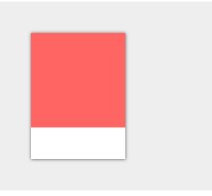

# 🎈 Create Complex Components

> 컴포넌트는 리액트가 비주얼 엘리먼트를 HTML,JS, 스타일 모두 포함하는 재사용 가능한 블록으로 만드는 주된 방법이다.

> 여러 컴포넌트를 조합해 더 복잡한 컴포넌트를 만들 수 있다.

## 간단한 팔레트 카드 만들기. 


1. 주요 비주얼 요소 식별
2. 컴포넌트로 만들 대상의 선별

### 주요 비주얼 요소 식별
- 우리가 다룰 모든 비주얼 요소를 식별하는 일이다.
- 카드안에는 특정 컬러를 보여주는 상단과 헥스 값을 보여주는 하단의 두 영역이 있다.

### 컴포넌트 식별
- 우리가 식별한 비주얼 요소 중에 어떤 것을 컴포넌트로 만들지 따져봐야한다.
- 컴포넌트로 만들 비주얼 요소를 선별하는 기법이 있다.
    -> ***하나의 컴포넌트는 하나의 역할만 해야한다.***

### 컴포넌트 작성
> 파일 위치 : html/05/complexComponent.html
``` js
    class Square extends React.Component{
        render(){
            return(
                <br/>
            );
        }
    }
    class Label extends React.Component{
        render(){
            return(
                <br/>
            );
        }
    }
    class Card extends React.Component{
        render(){
            return(
                <br/>
            );
        }
    }
```
- 계획대로 컴포넌트를 3개 정의해야한다.

#### Card Component
- 이 컴포넌트는 Square와 Label 컴포넌트가 상주할 컨테이너 역할을 할 것이다.
```js
 class Card extends React.Component{
        render(){
            var cardStyle = {
                    height:200,
                    width:150,
                    padding:0,
                    backgroundColor:"#FFF",
                    boxShadow:"0px 0px 5px #666"
                };
            return(
                <div style={cardStyle}>
                
                </div>
            );
        }
    }
```
- cardStyle 객체를 이용해 Card 컴포넌트의 출력 결과에 스타일을 적용한다.

```js
    ReactDOM.render(
        <div>
            <Card/>
        </div>,
        destination
    );
```
- ReactDOM.render 함수에서 DOM안에 Card 컴포넌트가 표시되게 한다.


#### Square Component
```js
 class Square extends React.Component{
        render(){
            var squareStyle = {
                height:150,
                backgroundColor:"#FF6663"
            };
            return(
                <div style={squareStyle}>
                </div>
            );
        }
    }
```

- squareStyle을 만든 후 ReactDOM.render메소드에 ```<Square />``` 을 추가해 브라우저에서 확인합니다.



#### Label Component
```js
class Label extends React.Component{
        render(){
            var labelStyle ={
            fontFamily:"sans-serif",
            fontWeight:"bold",
            padding:13,
            margin:0
        };
            return(
                <p style={labelStyle}>#FF6663</p>
            );
        }
    }
```

- Label Component를 만든 후 ReactDOM.render메소드에 ```<Label />```을 추가해 브라우저에서 확인한다.


#### 속성 전달
- 위에서는 Square와 Label 컴포넌트가 사용하는 컬러 값을 코딩했다.
- 하지만 이러한 방식은 너무 직관적이라 이상하다.
- 앞으로는 ```this.props``` 를 사용하는 방법을 이용할 것이다.
- **자식 컴포넌트에 속성 값을 전달하는 올바른 방법**이란, 부모 컴포넌트 각각이 속성 값을 일일이 전달해주는 것을 말한다.

1. Sqare Component
```js
class Square extends React.Component{
        render(){
            var squareStyle = {
                height:150,
                backgroundColor: this.props.color //this.props 사용
            };
            return(
                <div style={squareStyle}>
                </div>
            );
        }
    }
```
2. Label Component
```js
class Label extends React.Component{
        render(){
            var labelStyle ={
            fontFamily:"sans-serif",
            fontWeight:"bold",
            padding:13,
            margin:0
        };
            return(
                <p style={labelStyle}>{this.props.color}</p> // this.props 사용
            );
        }
    }
```

3. Card Component 
```js
  class Card extends React.Component{
        render(){
            var cardStyle = {
                    height:200,
                    width:150,
                    padding:0,
                    backgroundColor:"#FFF",
                    boxShadow:"0px 0px 5px #666"
                };
            return(
                <div style={cardStyle}>
                    <Square color = {this.props.color}/> //this.props 사용
                    <Label color = {this.props.color}/> //this.props 사용
                </div>
            );
        }
    }
```

4. ReactDOM.render
```js
 ReactDOM.render(
        <div>
            <Card color ="#FF6663" /> // color 지정!
        </div>,
        destination
    );
```
-  ***컴포넌트가 여러 계층으로 이루어진 경우에도 각 부모에 해당하는 컴포넌트 들은 모두 차례로 속성을 전달해야한다.***

