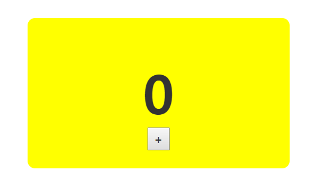

# 🎉 Event

> 지금까지의 예제는 모두 페이지가 로딩되면 작업이 완료되는 경우였다.<br>
하지만 대부분의 앱에서, 특히 풍부한 UI를 갖는 앱에서는 무엇인가에 반응해야하는 수많은 것들이 존재한다.
리액트가 event를 취급하는 방법은 약간 다르며, 그 차이에 대해 공부한다.

## Event Listening and React



#### Start
> 파일위치 : html/10/eventEx.html

#### 버튼 작동시키지
- 플러스 버튼을 클릭할 때마다 카운터의 값이 1씩 증가되어야 한다.
    1. button에 clickEvent Listening을 한다.
    2. 클릭에 반응해 counter가 의존하는 this.state.count 속성의 값을 증가시킬 event handler를 구현한다.

- CounterParent Component에 event를 리스닝한다.
`<button onClick={this.increase} style = {buttonStyle}> + </button>`
: onClick event가 발생하면 increase 함수를 호출

- increase 함수를 CounterParent에 추가한다.
`this.increase = this.increase.bind(this);`

```js
increase(a){
    this.setState({
        count : this.state.count +1
    })
}
```
- 이벤트 핸들러로 생성된 increase 함수는 이벤트를 인자로 받아야 하기 때문에 이벤트 인자 `e`로 지정했다.
- 생성자에서는 this를 increase 함수에 바인딩했다.

> bind? <p>
bind() 메서드는 this 키워드를 주어진 값으로 설정하고, 앞쪽의 매개변수도 자신의 인자를 사용해 미리 순서대로 채워놓은 새로운 함수를 반환한다.
즉, 함수가 가리키는 this만 바꾸고 호출하지 않는다.

## 이벤트 속성
#### 합성 이벤트
- 리액트의 특별한 유형인 SyntheticEvent를 다룬다.
- 이벤트 핸들러는 MouseEvent나 KeyboardEvent등과 같은 네이티브 이벤트 타입을 받지 않으며, 항상 브라우저의 네이티브 이벤트를 래핑하는 SyntheticEvent 타입을 인자로 받는다.
- SyntheticEvent는 다음과 같은 속성들을 포함한다.
```
boolean bubbles
boolean cancelable
DOMEventTarget currentTarget
boolean defaultPrevented
number eventPhase
boolean isTrusted
DOMEvent nativeEvent
void stopPropagation()
void PreventDefault()
boolean isDegaultPrevented()
boolean isPropagationStopped()
DOMEventTarget target
number timeStamp
string type
```
- MouseEvent 래핑하는 SyntheticEvent는 다음과 같이 마우스 이벤트에 특정적인 속성을 갖는다.
```
boolean altKey
number button
bumber buttons
number clientX
number clientY
boolean ctrlKey
boolean getModifierState(key)
boolean metaKey
number pageX
number pageY
DOMEventTarget relatedTarget
number screenX
number screenY
boolean shiftKey
```

- keyboardEvent를 래핑하는 SyntheticEvent는 다음과 같은 속성을 갖는다.
```
boolean altKey
number charCode
boolean ctrlKey
boolean getModifierState(key)
string key
number keyCode
string locale
number location
boolean metaKey
boolean repeat
boolean shiftKey
number which
```

- **결과적으로 SyntheticEvent를 가지고도 평범한 DOM 세계에서 했던 작업을 동일하게 할 수 있다는 의미**이다.

#### 이벤트 속성 다루기
- 위의 예제는 <button> + </button> 을 누를때 1씩 증가하는 counter이다.
- 이제 키보드의 shift를 누른채로 버튼을 누르면 카운터가 10씩 증가하는 코드를 만들어본다.
- 우리가 사용할 SyntheticEvent의 속성은 `shiftKey`이다.

```js
increase(e){

    var currentCount = this.state.count;

    if(e.shiftKey){
        currentCount += 10;
    }else{
        currentCount+= 1;
    }

    this.setState({
        count : currentCount
    })
}
```

- `var currentCount = this.state.count` 로 count의 속성을 받아온 후 `if/else`문을 통해 값을 추가시키는 코드를 작성한다.

## 또 다른 이벤트 처리 기법
#### Component의 이벤트는 직접 리스닝 할 수 없다.
`<PlusButton clickHandler={this.increase} />`

- Component는 DOM element를 감싸는 wrapper이기때문에 ***Component의 이벤트를 직접 리스닝 할 수 없다.***
- Component 안에서 DOM element에 event를 할당하고 속성의 값으로 이벤트 헨들러를 설정하면 된다.

```JS
 class PlusButton extends React.Component{
    render(){
        return(
            <button onClick={this.props.clickHandler}> 
            + 
            </button>
        )
    }
 }
```
- button element에 onClick 이벤트를 추가하고 그 값으로 clickHandler 속성을 지정했다.
- 런타임 시에 이 속성은 increase 함수로 평가되며 button을 click했을때 increase 함수의 호출이 보장된다.

## React에서의 event 처리
**1. 브라우저 호환성**
- 이벤트 처리는 오늘날 브라우저 사이에서 일관되게 작동하는 기능 중 하나이다.
- 리액트는 모든 네이티브 이벤트를 SyntheticEvent 타입의 객체로 wrapping함으로써, 호환되지 않는 환경에서도 이벤트 처리를 동일한 방법으로 할 수 있게 했다.

**2. 성능 향상**
- 복잡한 UI를 갖는 앱에서 더 많은 이벤트 핸들러를 만들수록 앱은 더 많은 메모리를 차지하게 된다.
- 리액트는 절대로 이벤트 핸들러를 DOM element에 직접 부착하지 않는다.
- 리액트는 문서 최상위에있는 하나의 이벤트 핸들러를 사용한다.

