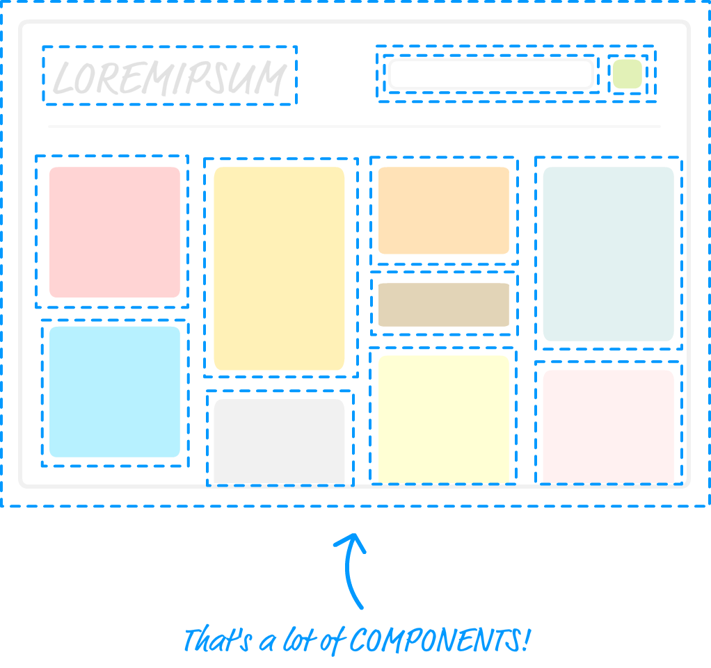
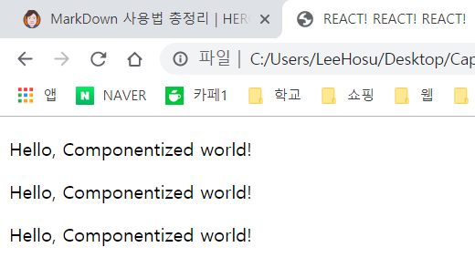
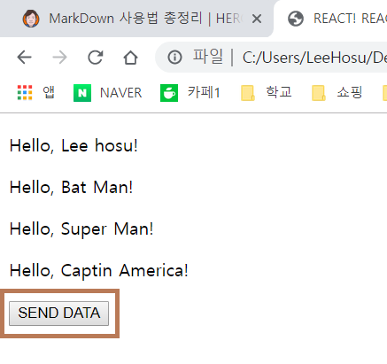

# 🎡 React Component
> 컴포넌트는 리액트를 가장 리액트 답게 만드는 것 중 하나다.
> 사용자가 앱을 사용할때 보게되는 비주얼과 그 상호작용을 정의하는 주된 방법이다.



- 점선으로 둘러싸인 각 부분은 모양과 기능을 책임지는 개별 컴포넌트를 나타낸다.

#### UI를 다루는 방식의 변화
> 파일 위치 : html/03/ex3.html
```js
    ReactDOM.render(
            <div>
                <h3>lee hosu</h3>
                <h3>Iron man</h3>
                <h3>Super man</h3>
                <h3>Awsome React</h3>
            </div>,
            destination
        );
```
- div로 h3의 태그를 하나로 감싸준다. 하지만 이렇게 h1태그의 속성을 수정하거나 추가하고 싶으면 일일이 달아줘야한다.

> **함수**가 갖는 특징을 적용한다면?

## Componet 사용하여 Hello, World! 출력하기

> 파일위치 : html/03/component.html
``` js
     var destination = document.querySelector("#container");
        class HelloWorld extends React.Component{
            render(){
                return <p>Hello, Componentized world!</p>
            }    
        }
        
        ReactDOM.render(
            <div>
                 <HelloWorld/>
                 <HelloWorld/>
                 <HelloWorld/>
            </div>,
            destination
        );
```


- 컴포넌트를 사용하는 방법은 여러가지가 있지만, class 문법을 사용한다.
```js
class HelloWorld extends React.Component{
    render(){
        return <p>Hello, Componentized world!</p>
    }    
}
```
- React.Component를 확장했으므로 HelloWorld라는 컴포넌트를 하나 만들었다. 
- 추후 HelloWorld가 해야 할 일을 정의하기 위해 이 클래스 안에 어떤 종류의 속성이든 넣을 수 있다.
- HelloWorld 컴포넌트를 사용하려면 함수처럼 호출하면 된다.
- 호출하는 방법은 HTML 처럼 생긴 ```<HelloWorld/>```로 호출한다.

#### 컴포넌트의 속성 추가
```js
class HelloWorld extends React.Component{
    render(){
        return <p>Hello, {this.props.greetTarget}!</p>
    }    
}

ReactDOM.render(
    <div>
        <HelloWorld greetTarget="Lee hosu"/>
        <HelloWorld greetTarget="Bat Man"/>
        <HelloWorld greetTarget="Super Man"/>
        <HelloWorld greetTarget="Captin America"/>
    </div>,
    destination
);
```

1. 컴포넌트 정의 변경
- 처음 해야 할 일은 속성으로 넘어온 값을 리턴 할 수 있게 컴포넌트의 동작을 변경하는 일이다.
- 그러려먼 속성의 이름이 필요한데, greetTarget을 사용했다.
- ```{this.props.greetTarget}``` : 모든 컴포넌트가 접근 할 수 있는 props라는 속성을 통해 호출한다.

2. 컴포넌트 호출 변경
- 컴포넌트 호출 시 속성 값을 전달하게 하는 일이다.
- 컴포넌트 속성의 이름과 동일한 이름의 엘리먼트 속성을 추가함으로써 가능하다.
- ```<HelloWorld greetTarget="Lee hosu"/>``` : greetTarget 속성으로 호출마다 나오게 되는 이름을 정의했다.
> 컴포넌트의 속성은 하나가 아니어도된다.
> 원하는 만큼 속성을 추가할 수 있으며 props에는 어떤 속성의 요청이라도 어렵지 않게 수용한다.

## 자식 다루기
JSX컴포넌트는 HTML element와 상당히 유사하다. 
```
class Buttonify extends React.Component{
    render(){
        return(
            <div>
                <button type = {this.props.behavior}>{this.props.children}</button>
        );
    }
}

ReactDom.render(
    <div>
        <Buttonify behavior="submit"> SEND DATA </Buttonify>
    </div>,
    destination
)
```


- Buttonify이라고 하는 커스텀 속성은 button element의 type속성을 지정해, 컴포넌트의 render 메소드에서 this.props.behavior를 통해 접근할 수 있다.
- 만약 자식 element가 어떤 텍스트라면 this.props.children속성은 문자열을 리턴한다.

# 정리
> 리액트를 사용해 앱을 만들고자 한다면 컴포넌트를 사용하지 않고서는 결코 할 수 없다.
> 리액트 컴포넌트는 JSX를 통해 HTML element를 출력할 수 있는, **재사용 가능한** 자바스크립트 덩어리이다.