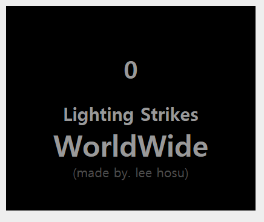

# 🤞 State Controll

> 지금까지 다룬 Component는 무상태 Component였다. 즉, 한번 설정되면 변하지 않는 속성처럼 사용됐다. 

> 속성의 수준을 넘어 컴포넌트에 데이터를 저장하는 또 다른 방법이 필요하다. 즉, 변경되는 데이터를 저장한다는 의미이다.

## Example Overview


> 파일위치 : html/08/stateEx.html



## Use of State
- 1초에 100씩 Count가 증가하는 번개 카운터를 예시로 만들어본다.

#### LightingCounter Component
```js
class LightingCounter extends React.Component{
        render(){
            return(
                <div>
                    <h1> Hello! </h1>
                </div>
            );
        }
    }
```

#### LightCounterDisplay Component
```js
  class LightingCounterDisplay extends React.Component{
        render(){
            var divStyle = {
                width:250,
                textAlign :"center",
                backgroundColor:"black",
                padding:40,
                fontFamily:"sans-serif",
                color:"#999",
                borderRaius:10
            };

            return(
                <div style ={divStyle}>
                    <LightingCounter />
                </div>
            );
        }
    }
```

#### ReactDOM.render method
```js
ReactDOM.render(
        <div>
            <LightingCounterDisplay />
        </div>,
        destination
     );
```

- 위의 컴포넌트에 대해 잠깐 보자면, ReactDOM.render에서 LightCountDisplay라는 Component를 호출하고 LightCountDisplay Component에서는 LightCount Component를 호출한다. 
- 결국 모든 일이 벌어지는 Component는 LightCount 이다.

## Use Counter
- setInterval 함수를 이용해 1000 밀리초마다 어떤 코드를 호출한다.
- 이 모든 걸 가능하게 하려면 React Component가 제공하는 2개의 API에 의존해야한다.

**1. ComponentDidMount**
    - 이 메소드는 Component가 Rendering 된 후에 실행된다.

**2. setState**
    - 이 메소드는 state 객체의 값을 갱신할 수 있게 해준다.

#### Early Value Setting
- 우선 카운트 역할을 할 변수가 필요하다.
`var strikes = 0;`
- state 객체를 만들고 그 속성으로 strikes 변수를 사용함으로써 컴포넌트가 생성될 때 그 모든 준비가 되게끔 한다.

```js
constructor(props){
    super(props);

    this.state = {
        strikes:0
    };
}
```
- `constructor(props)` :  class 내에서 객체를 생성하고 초기화하기 위한 특별한 메서드이다. 또, 한 Component당 1개씩만 소유할 수 있으며 두 개 이상의 constructor 메서드는 SyntaxError를 유발한다.
그리고 생성자 메서드는 super 키워드를 사용하여 상위 클래스의 생성자 메서드를 호출할 수 있다.
    -> 간단히 생각해 ***초기화*** 를 시켜주는 **Component Method**

- rendering 되기전에 실행되게 하기 위해 LightingCounter Component의 생성자 안에 state 객체를 지정했다.
- 즉, 0으로 초기화된 strikes 속성을 담은 객체를 준비하라는 의미이다.
- 이를 확인하기 위해서는 `{this.state.strikes}`로 확인 가능하다.

#### 타이머의 가동과 상태 설정
- Component가 rendering 된 직후부터 실행되는 내장 componentDidMount 메소드를 이용한다.

```js
componentDidMount(){
    setInterval(this.timerTick, 1000);
}
```
- `componentDidMount()` 메소드는 Component가 rendering 된 후에 한 번 호출하므로, 그 안에 매초마다 timerTick 함수를 호출하는 setInterval 메소드를 추가한다.

```js
  timerTick(){
            this.setState({
                strikes : this.state.strikes + 100
            });
        }
```
- timerTick 함수는 단지 setState를 호출 할 뿐이다.
- setState 메소드는 여러 형태로 사용할 수 있지만 여기서는 객체 하나를 인자로 받게 했다.
- 여기서는 현재 값에 100을 더한 값으로 설정한 strikes 속성을 넣었다.
-  component에 timerTick함수는 추가 되었지만 그 컨텐츠에 component의 context가 유지되지 않는다.

- `this.timerTick = this.timerTick.bind(this)` 를 추가하여 timerTick 함수를 component에 명시적으로 binding 하는 방법을 사용한다.

#### 상태 변경 후 렌더링 ( 비동기 )
- **setState를 통해 state 객체에 어떤 내용이 변경될 때마다 Component의 render 메소드가 자동적으로 호출된다.**
- 이는 다시 연관된 다른 모드 컴포넌트들의 render 함수를 연쇄적으로 호출한다.
- 그 모든 작업의 결과로 UI에 최종적인 상태가 화면에 보여지게 된다.