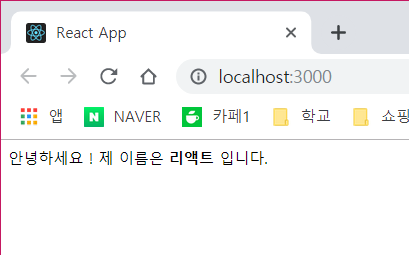
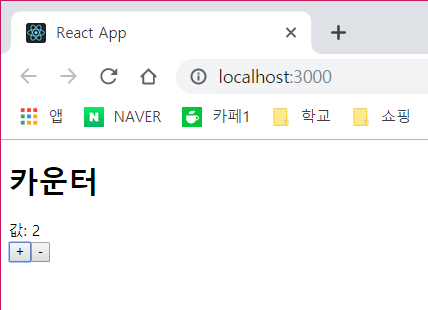

# 🧛 Props And State

> React Component에서 다루는 데이터는 크게 props와 state 이다.
props는 부모 Component가 자식 Compopnent에게 주는 값이고, state는 Component 내부에서 선언하며 내부에서 값을 변경 할 수 있다.

## Create New Component
`create-react-app propstate`

#### src/MyName.js
```js

import React, { Component } from "react";

class MyName extends Component{

    render(){    
        return (
            <div>
                안녕하세요 ! 제 이름은 <b>{this.props.name}</b> 입니다.
            </div>
        );
    }
}

export default MyName;
```
- 자신이 받아온 props 값은 `this.` 키워드를 통해 조회가 가능하다.


#### src/App.js
```js
import React, { Component } from 'react';
import MyName from './MyName';

class App extends Component {
  render() {
    return (
      <MyName name="리액트" />
    );
  }
}

export default App;
```
- MyName Component를 import로 불러오고, 렌더링한다.
- props의 값은 `name = "리액트"` 와 같은 식으로 속성을 설정한다.



## defaultProps
- 특정 상황에 props를 비우거나 빼먹었을때 props의 기본 값을 설정할 수 있다.

#### src/MyName.js
```js
class MyName extends Component{
    static defaultProps = {
        name : '이호수'
    }
    render(){    
        return (
            <div>
                안녕하세요 ! 제 이름은 <b>{this.props.name}</b> 입니다.
            </div>
        );
    }
}
```

혹은
```js
class MyName extends Component{
    render(){    
        return (
            <div>
                안녕하세요 ! 제 이름은 <b>{this.props.name}</b> 입니다.
            </div>
        );
    }
}

Myname.defaultProps = {
    name : "이호수"
};
```

## Functional Component
- 함수 형태로 작성하면 더욱 간단하게 작성이 가능하다.

#### src/MyName.js
```js
import React from "react";

const MyName = ({ name }) => {
    return (
      <div>
        안녕하세요! 제 이름은 {name} 입니다.
      </div>
    );
  };

MyName.defaultProps = {
    name : "이호수"
}
export default MyName;
```

- 함수형 컴포넌트와 클래스형 컴포넌트의 차이점은 state와 lifeCycle이 빠져있다는 점이다.

## state
- 동적인 데이터를 다룰땐 state를 사용한다.

#### src/Counter.js
```js
import React, { Component } from 'react';

class Counter extends Component {
  constructor(props){
      super(props);

      this.state = {
          name :0
      }
  }

  handleIncrease = () => {
    this.setState({
      number: this.state.number + 1
    });
  }

  handleDecrease = () => {
    this.setState({
      number: this.state.number - 1
    });
  }

  render() {
    return (
      <div>
        <h1>카운터</h1>
        <div>값: {this.state.number}</div>
        <button onClick={this.handleIncrease}>+</button>
        <button onClick={this.handleDecrease}>-</button>
      </div>
    );
  }
}

export default Counter;
```


## 코드 분석
#### 초기화
```js
 constructor(props){
      super(props);
   
      this.state = {
          number : 0
      }
      this.handleDecrease = this.handleDecrease.bind(this);
      this.handleIncrease = this.handleIncrease.bind(this);
  }
```
- 초기화를 위한 부분이다.
- `constructer`에서 `super(props)`를 호출 함으로써 우리가 Component를 만들게 되면서 기존의 클래스 생성자를 덮어쓰게 된다.
- react Component가 지니고 있던 생성자를 `super`를 통해 미리 실행하고, 그 다음에 우리가 할 작업(state)를 설정한다.
- `handleDecrease` 나 `handleIncrease`에 대해 `bind`를 해주지 않으면 click event가 발생했을 때  this가 undefine으로 나타나 제대로 연결되지 않는다. 

#### 메소드 분석
```js
  handleIncrease() {
    this.setState({
      number: this.state.number + 1
    });
  }

  handleDecrease() {
    this.setState({
      number: this.state.number - 1
    });
  }
```
- 여기서 this가 끊어지지 않게 `constructor`부분에서 `bind`를 해준다.
- 하지만 위처럼 하지않고 `화살표 함수`를 사용하면 간단하게 구현된다.

```js
  handleIncrease = () => {
    this.setState({
      number: this.state.number + 1
    });
  }

  handleDecrease = () => {
    this.setState({
      number: this.state.number - 1
    });
  }
```

## setState
- state에 있는 값을 바꾸기 위해서는 this.setState를 무조건 거쳐야한다.
- 리액트에서는 이 함수가 호출되면 Component가 rerendering되게끔 설계 되어있다.
- setState는 객체로 전달되는 값만 update 해준다.

## event Handler
```js
  render() {
    return (
      <div>
        <h1>카운터</h1>
        <div>값: {this.state.number}</div>
        <button onClick={this.handleIncrease}>+</button>
        <button onClick={this.handleDecrease}>-</button>
      </div>
    );
  }
```
- react에서 이벤트 함수를 설정할 때에 주의해야한다.
    1. 이벤트 이름은 camelCase로 작성해야한다.
    2. 이벤트에 전달해줘야하는 값은 **함수** 여야한다.
    만일, ` <button onClick={this.handleIncrease()}>` 이렇게 선언하게 된다면, 렌더링 할때마다 함수가 호출된다. 그렇게되면 렌더링 -> 함수 호출 -> setState -> 렌더링 -> 함수호출 -> 무한반복이 되어 버린다.
- **렌더링 함수에서 이벤트를 설정할때 메소드를 호출하지 않는다.**


> 리액트를 다룰때 props는 사용을 권장하는 반면 state는 줄이것을 권장한다.

> props는 외부에서 오는 데이터이므로 Component내부에서 변경하면 안된다.

> Component내부에서 관리해야할 데이터가 있다면 state를 사용해야 한다.