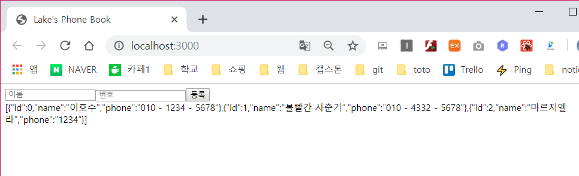
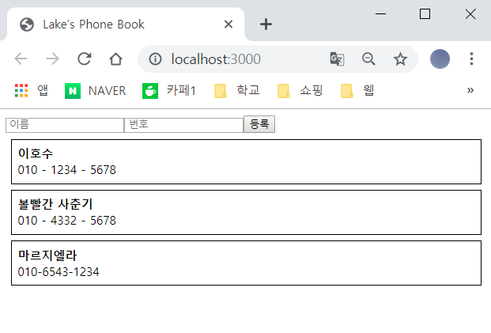

# Array Controll

---
- react에서 배열을 다루는 법에 대해 공부해본다.
- react에서는 state 내부의 값을 직접적으로 수정하면 절대로 안되기 때문에 일반적인 js 문법의 `push`,`pop`,`splice`,`unshift`등을 쓰면 안되고 기존의 배열에 기반하여 조건에 맞는 새 배열을 만들어 내는 `map`,`filter`,`slice`,`concat`등을 사용하는 것이 올바르다.
- react에서는 `불변성` 유지가 가장 중요한데 모든 것들이 필요한 상황에 리렌더링 되도록 설계 할 수 있고, 성능 최적화도 생각 할 수 있다. 
---

## Add Data
- App Component의 state에 information이라는 배열을 만들고, 그 안에 기본 값인 샘플 데이터를 넣어둔다.

```js
...

class App extends Component { 
    id = 0
    state = {
        information: [
            {
                id : this.id ++,
                name : '이호수',
                phone : '010 - 1234 - 5678'
            },
            {
                id : this.id++,
                name : '볼빨간 사춘기',
                phone : '010 - 4332 - 5678'
            }
        ]
    }
    handleCreate = (e) => {
        const { information } = this.state;
        this.setState({
            information : information.concat({
                id : this.id ++,
                ...e
            })
        })
        console.log(e);
    }
    render() { 
        const { information } = this.state;
        return ( 
        <div className = "App">
            <PhoneForm onCreate = {this.handleCreate}/>
            {JSON.stringify(information) }
        </div>
        ); 
    } 
} 

export default App;
```

- id 값의 경우 샘플데이터를 생각해서 `this.state`로 데이터 하나마다 `++`로 1씩 증가되게 설정한다.
- render 함수에서는 `JOSN.stringfy(information)`을 통해 information 값을 문자열로 변환하여 보여준다.




## Data Rendering
- 위의 배열을 Component로 바꿀 차례이다.
- component를 여러개 렌더링하기 위해서는 다른 걸 사용할 필요없이 자바스크립트 내장 함수인 `map`을 이용하면 된다.

### make component 
- 같은 위치 (`src/components/`)에 `PhoneInfo.js`와 `PhoneInfoList.js`를 만든다.

```js
//PhoneInfo.js
import React, { Component } from 'react';

class PhoneInfo extends Component{
    static defaultProps = {
        info : {
            name : '이름',
            phone : '010-1234-5678',
            id : 0
        }
    }
    render(){
        const style = {
            border: '1px solid black',
            padding: '8px',
            margin: '8px'
        };

        const {
            name, phone
        } = this.props.info;

        return (
            <div className = "App-main" style = {style}>
                <div><b>{name}</b></div>
                <div>{phone}</div>
            </div>

        );
    }
}

export default PhoneInfo;
```
- `PhoneInfo` Component는 각 전화번호 정보를 보여주는 Component이다.
- `info`라는 객체를 props로 받아와 렌더링 한다. 그러나 우리가 실수로 info 값을 전달해주는 것을 까먹게 된다면 info의 값이 undefined일때에 비구조화 할당을 통해 내부의 값을 받아 올 수 없기에 component가 `crash` 될 것이다. 
- 그렇기에 `defaultProps`를 통해 info의 초기값을 설정해준다.

```js
//PhoneInfoList.js
import React, { Component } from 'react';
import PhoneInfo from './PhoneInfo';

class PhoneInfoList extends Component{
    static defaultProps ={
        data : []
    };
    render(){

        const { data } = this.props;
        const list = data.map(
            info => (<PhoneInfo key = {info.id} info = {info} />)
        )
        return(
            <div>
                {list}
            </div>
        )
    }
}
export default PhoneInfoList;
```
- 이 component에서는 data라는 배열을 가져와 map()을 통해 JSX로 변환시켜준다.
- 이 과정에서 `key`가 설정되어 있는데 react에서 배열을 렌더링 할때에 꼭 설정해줘야하는 값이다.
- 여기에서는 `id`의 값을 `key`로 설정해줬다.
- 이제 `App.js`에서 렌더링 해준다.

```js
//App.js
...
    render() {
        return ( 
        <div className = "App">
            <PhoneForm onCreate = {this.handleCreate}/>
            <PhoneInfoList data={this.state.information}/>
        </div>
        ); 
    } 
} 
...
```



