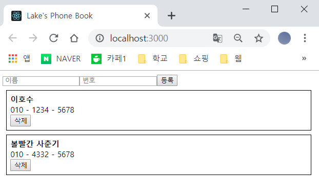
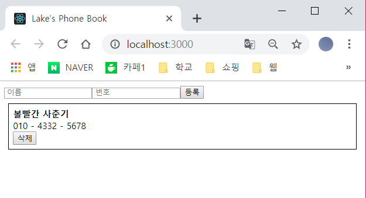
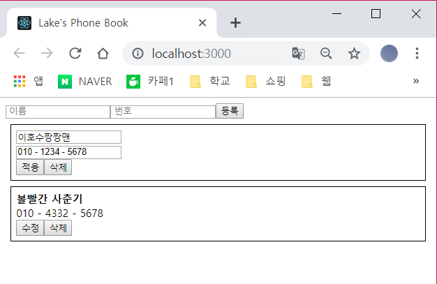
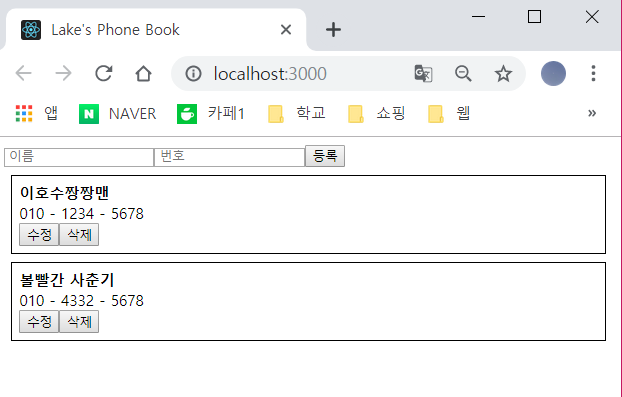

# Delete And Update

---
- 배열 내부의 데이터를 수정 및 제거하는 것에 대해서 공부해본다.
---

## Data Delete
- 기존 JS에서 배열 데이터를 건들지 않으면서 데이터를 제거하기 위해서 여러 방법이 있지만 대표적으로 `slice`,`concat`등을 이용해 제거할 수 있다.


##### Example
```js
const arr = [1, 2, 3, 4, 5];
array.slice(0,2).concat(array.slice(3,5)) // [1, 2, 4, 5]
```
- 위와 같은 식으로 `slice`로 배열을 자른 후 `concat`으로 이어주는 방법이다.
- 하지만 위와 같은 방법은 복잡하기에 배열의 내장 함수인 `filter`를 이용해 배열 내부의 특정 데이터를 제거하여 새로운 배열을 만들어 위와 같이 표현할 수 있다.

```js
const arr = [1, 2, 3, 4, 5];
array.filter(num => num !== 3); // [1, 2, 4, 5]
```
### Build
- id를 피라미터로 받아오는 hadleRemove라는 함수를 만들고 위와 같이 delete 기능을 만들어본다.

```js
//파일위치 : src/App.js
...
    handleRemove = (id) => {
        const { information } = this.state;
        this.setState({
            information : information.filter(
                info => info.id !== id
            )
        })
    }

    render() {
        return ( 
        <div className = "App">
            <PhoneForm onCreate = {this.handleCreate}/>
            <PhoneInfoList 
                data={this.state.information}
                onRemove = {this.handleRemove}
                />
        </div>
        ); 
    } 
} 
...
```
- 그 후 PhoneInfoList에서는 props로 전달받은 `onRemove`를 그대로 전달한다. 함수가 전달되지 않았을시를 대비해 해당 props를 위한 defaultProps도 설정해준다.

```js
// 파일 위치 : src/components/PhoneInfoList.js
...
class PhoneInfoList extends Component{
    static defaultProps ={
        list : [],
        onRemove : () => console.warn('not exist remove data')
    };

    render(){

        const { data, onRemove } = this.props;
        const list = data.map(
            info => (
                <PhoneInfo 
                    key = {info.id} 
                    info = {info} 
                    onRemove = {onRemove}    
                />)
        )
...

```

- 그 후 PhoneInfo에서 삭제 버튼과 이벤트를 만들어준다.

```js
// 파일 위치 : src/components/PhoneInfo.js
...
    handleRemove = () => {
        const { info, onRemove } = this.props;
        onRemove(info.id);
    }
...
    return (
        <div className = "App-main" style = {style}>
            <div><b>{name}</b></div>
            <div>{phone}</div>
            <button onClick={this.handleRemove}>삭제</button>
        </div>
...
```





## Data Update
- 데이터 수정을 할때는 `불변성`을 지켜줘야 한다.
- 기존의 배열과 그 내부에 있는 객체 및 데이터들을 절대로 직접 수정해서는 안된다.
- 여기서 아이디어는 **`map 함수`를 활용해서 데이터를 수정하여 새로운 배열을 반환**하는 것이다.

##### Exmaple

```js
const array = [
  { id: 0, text: 'hello', tag: 'a' },
  { id: 1, text: 'world' , tag: 'b' },
  { id: 2, text: 'bye', tag: 'c' }
];
```
- 위와 같은 형태의 객체가 있다고 가정하자.
- 여기서 id가 1인 객체의 text 값을 수정하고 싶을때 `map 함수`를 사용한다.

```js
const modifiedArray = array.map(item => item.id === 1
  ? ({ ...item,. text: 'Korea' }) 
  : item
```
- id 가 일치하면 새 객체를 만들고, 기존의 내용을 집어넣고 원하는 값 덮어쓰며 바꿀 필요가 없는 것들은 기존의 값을 사용한다.

### Build
- 여기서 중요한 idea는 `edit모드`를 만들어주는 것이다.
- `edit`라는 속성을 `state` 객체에 추가하여 속성처럼 버튼을 클릭시 `ture`, `false`가 선택되게 하는 방식이다.

```js
// 파일 위치 : src/App.js
...
    handleUpdate = (id, data) => {
        const { information } = this.state;
        this.setState ({
            information : information.map(
                info => id === info.id
                ? { ...info, ...data}
                : info
            )
        })
    }

    render() {
        return ( 
        <div className = "App">
            <PhoneForm onCreate = {this.handleCreate}/>
            <PhoneInfoList 
                data={this.state.information}
                onRemove = {this.handleRemove}
                onUpdate = {this.handleUpdate}
                />
        </div>
        ); 
    } 
} 
export default App;
```

- 먼저, `id`와`data`라는 피라미터를 받아 정보를 update하는 handleUpdate라는 함수를 만들어준다.
- 이 함수는 PhoneInfoList의 `onUpdate`로 전달해준다.

```js
// 파일 위치 : src/components/PhoneInfoList.js
...
class PhoneInfoList extends Component{
    static defaultProps ={
        list : [],
        onRemove : () => console.warn('not exist remove data'),
        onUpdate : () => console.warn('not exist update data')
    };

    render(){

        const { data, onRemove, onUpdate } = this.props;
        const list = data.map(
            info => (
                <PhoneInfo 
                    key = {info.id} 
                    info = {info} 
                    onRemove = {onRemove}
                    onUpdate = {onUpdate}    
                />)
        )

        return(
            <div>
                {list}
            </div>
        )
    }
}
export default PhoneInfoList;
```
- 데이터를 컴포넌트로 렌더링 하는 과정에서 PhoneInfo에 `onUpdate`를 그대로 전달해준다.

```js
// 파일 위치 : src/components/PhoneInfo.js
...
    state = {
        editing : false,
        name : '',
        phone : ''
    }
...
    handleToggleEdit = () => {
        const { editing } = this.state;
        this.setState({
            editing : !editing
        })
    }

    handleChange = (e) => {
        const { name, value } = e.target;
        this.setState({
            [name] : value
        });
    }

    componentDidUpdate(prevProps, prevState){
        const { info, onUpdate } = this.props;
        if(!prevState.editing && this.state.editing){
            this.setState({
                name : info.name,
                phone : info.phone
            })
        }
        
    if(prevState.editing && !this.state.editing){
        onUpdate(info.id, {
            name : this.state.name,
            phone : this.state.phone
        });
    }
    }

    render(){

        const style = {
            border: '1px solid black',
            padding: '8px',
            margin: '8px'
        };

        const { editing } = this.state;

        if(editing){
            if (editing) { // 수정모드
                return (
                  <div style={style}>
                    <div>
                      <input
                        value={this.state.name}
                        name="name"
                        placeholder="이름"
                        onChange={this.handleChange}
                      />
                    </div>
                    <div>
                      <input
                        value={this.state.phone}
                        name="phone"
                        placeholder="전화번호"
                        onChange={this.handleChange}
                      />
                    </div>
                    <button onClick={this.handleToggleEdit}>적용</button>
                    <button onClick={this.handleRemove}>삭제</button>
                  </div>
                );
              }
        }

        const {     //일반 모드
            name, phone
        } = this.props.info;

        return (
            <div className = "App-main" style = {style}>
                <div><b>{name}</b></div>
                <div>{phone}</div>
                <button onClick={this.handleToggleEdit}>수정</button>
                <button onClick={this.handleRemove}>삭제</button>
            </div>

        );
    }
}

export default PhoneInfo;

```
- 여기서 집중해야하는 것은 form이 `edit mode`, `normal mode`로 나눠져 있다는 것이다.
- state객체의 속성을 보게되면 `editing`이라는 속성이 있는데 초기값이 `false`로 설정되어있다.
- 여기서 edit 버튼을 누르게되면 이 속성 값이 `!editing`이 되어 `ture`값은 `false`로, `false`는 `true`로 바뀌게 된다.
- 속성이 바뀔때 `componentDidUpdate` 함수를 주의해야하는데,여기서는, editing 값이 바뀔 때 처리 할 로직이 적혀있다. 수정을 눌렀을땐, 기존의 값이 input에 나타나고, 수정을 적용할땐, input 의 값들을 부모한테 전달해준다.
- 즉, 수정 버튼을 클릭했을때 초기 state의 `editing` 속성 값인 `false`가 `ture`로 바뀌고 info의 값을 state에 넣어준다. 수정 후 다시 버튼을 클릭하면 또 위와 같은 로직이 실행된다.
- 마지막으로 `edit mode`와 `normal mode`를 만들어 각각 다른 form이 실행되게 로직을 구성하였다.





