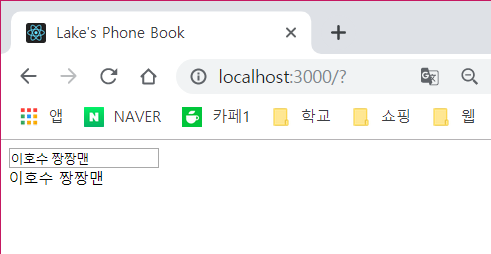
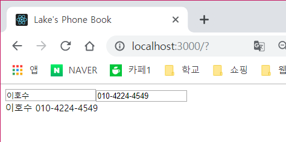
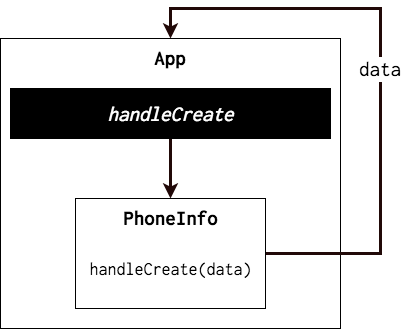
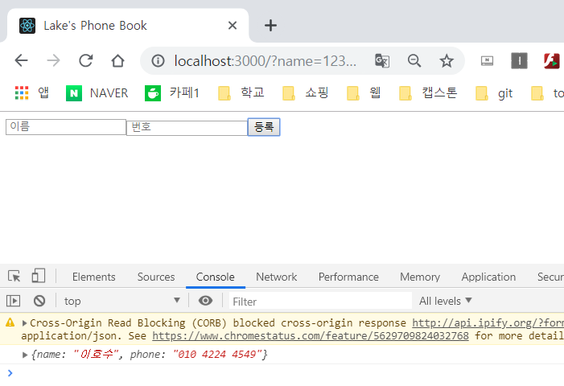

# Input Controll

---
- 전화 번호부 프로젝트를 만들어 볼텐데, input 상태를 관리하는 법과 배열을 중심으로 설명한다. 
---

## Create Component
- 먼저 만들 Component는 PhoneForm 이다. 이 Component는 사용자에게 이름과 전화번호를 입력받는 Form이다. 
- input Component의 입력을 `state`에 담는다.


### 1. PhoneFrom 만들기

#### input 다루기
- `src/components`라는 디렉토리를 만든다.
- 그 안에 `PhoneForm.js`를 만들고 아래의 코드를 입력한다.

```js
import React, { Component } from 'react';

class PhoneForm extends Component{
    state = {
        name : ''
    }

    handleChange = (e) =>{
        this.setState({
            name : e.target.value
        })
    }

    render(){
        return (
            <form>
            <input
                placeholder = " 이름 "
                value = {this.state.name}
                onChange = {this.handleChange}
            />
            <div>{this.state.name}</div> 
        </form>
        );
    }
}

export default PhoneForm;
```
- `onChange` 이벤트가 발생하면 `e.target.value` 값을 통하여 이벤트 객체로 접근하여 input에 적혀있는 name을 보여준다.
- render 부분에서 input을 렌더링 할때 `value`값과 `onChange` 값을 넣어줘서 값이 수시로 변할때를 대응했다.
- `<div>{this.state.name}</div>` 이 부분을 통해 `name` input에 값이 잘바뀌고 있는지 확인 할 수 있도록 렌더링한다.

- 그 후 `App.js`에서 `PhoneForm`을 추가해주면 브라우저에 나타난다.




```js
import React, { Component } from 'react';

class PhoneForm extends Component{
    state = {
        name : '',
        phone : ''
    }

    handleChange = (e) =>{
        this.setState({
            [e.target.name] : e.target.value
        })
    }

    render(){
        return (
            <form>
            <input
                placeholder = " 이름 "
                value = {this.state.name}
                onChange = {this.handleChange}
                name = "name"
            />
            <input
                placeholder = " 번호 "
                value = {this.state.phone}
                onChange = {this.handleChange}
                name = "phone"
            />
            <div>{this.state.name}{this.state.phone}</div> 
        </form>
        );
    }
}

export default PhoneForm;
```

- 전화번호도 입력 받아야하니 `input` form을 하나 더 추가한다.
- input이 2개이다보니 `name`을 부여한다. 여기서 `name`은 `name`과 `phone`이 된다.
- 렌더링하기전 초기 상태인 `state`에 'name'과 'phone'을 공백으로 초기화해준다.
- 이제 `onChange` 이벤트를 사용하기 위해 `name`을 기준으로 구분을 해야하는데 그것이 바로 `this.setState`안에 있는 `[e.target.name]`를 통해 조회할 수 있다.
- 이 후 브라우저를 통해 확인해 보면 



#### 부모 컴포넌트에 정보 전달하기
- 이제 state 안에 있는 값을 부모 component에게 전달해줄 차례이다.
- 부모 컴포넌트에서 메소드를 만들고, 이 메소드를 자식에게 전달한 다음 자식 내부에서 호출하는 방식을 이용한다.



- 먼저 App.js`에서 handleCreate라는 메소드를 만들고, 이를 PhoneForm한테 전달해준다.
- 그 후, PhoneForm에서 submit 버튼을 만들어 submit이 발생하면 props로 받은 함수를 호출하여 `App.js`에서 피라미터로 받은 값을 사용할 수 있도록 한다.

```js
...
class App extends Component { 
    handleCreate = (e) => {
        console.log(e);
    }
    render() { 
        return ( 
        <div className = "App">
            <PhoneForm onCreate = {this.handleCreate}/>
        </div>
        ); 
    } 
} 

export default App;

```

- 그 후 `PhoneForm.js`에서 submit 이벤트를 설정한다.
```js

...

    handleSubmit = (e) => {
        e.preventDefault();
        this.props.onCreate(this.state);
        this.setState({
            name : '',
            phone : ''
        })
    }

    render(){
        return (
            <form onSubmit = {this.handleSubmit}>
            ...
            <button type = "submit"> 등록 </button>
        </form>
        );
    }
}

export default PhoneForm;

```

- handleSubmit 함수를 확인해보면 맨 위에 `e.preventDefault()`가 선언되어있는데 이는 원래 이벤트가 설정되어있으면 그 작업을 방지시킨다는 의미이다. 즉, 원래는 form에서 `submit`이 발생하면
페이지가 `reload`가 되는데 우리의 코드에서 이러한 이벤트는 현재 지니고 있는 `state`를 다 잃어버리니 방지시켜준다.
- 그 다음, `props`로 받은 `onCreate` 함수를 호출하므로써 상태값을 초기화 해준다.
- 즉, input form에 이름과 번호를 작성한 후 버튼을 누르게 되면 현재 state가 submit 효과로 인해 `App.js`의 `handleCreate`로 넘어가 console에 name과 phone이 출력되고 그 후 `onCreate` 함수를 호출하여 input form에 있는 state를 초기화 해준다.




[다음으로](./ArrayControll.md)
